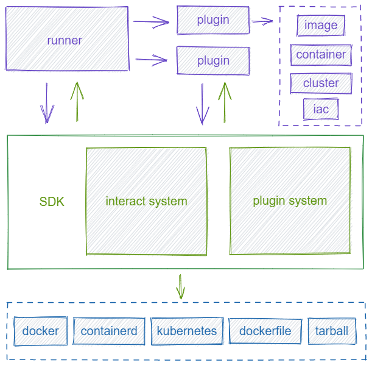

<p align="center">
  
</p>
<h1 align="center"> veinmind-tools </h1>
<p align="center">
  <a href="https://veinmind.chaitin.com/docs/">Documentation</a> 
</p>

<p align="center">


<p align="center"> veinmind-tools is self-developed by <a href="https://www.chaitin.cn/en/"> chaitin technology </a>，
cloudwalker team incubation，a container security toolset based on <a href="https://github.com/chaitin/libveinmind">veinmind-sdk</a>  </p>
</p>

## 🔥 Demo


Veinmind has been connected to openai. You can use openai to conduct a user-friendly analysis of the scan results, allowing you to have a clearer understanding of the risks identified during this scan.


## 🕹️ Quick Start

### 1. Make sure docker is installed correctly on the machine

```
docker info
```

### 2. Install [veinmind-runner](https://github.com/chaitin/veinmind-tools/tree/master/veinmind-runner) image

```
docker pull registry.veinmind.tech/veinmind/veinmind-runner:latest
```

### 3. Download [veinmind-runner](https://github.com/chaitin/veinmind-tools/tree/master/veinmind-runner) parallel container startup script

```
wget -q https://download.veinmind.tech/scripts/veinmind-runner-parallel-container-run.sh -O run.sh && chmod +x run.sh
```

### 4. Quick scan local images/containers

```
./run.sh scan [image/container]
```

### 5. use ai analyze

```
./run.sh scan [image/container] --enable-analyze --openai-token  <your_openai_token>
```

> Note: When using openAI, please ensure that the current network can access openAI
> When starting a parallel container, you need to manually use docker run -e http_proxy=xxxx -e https_proxy=xxxx Set proxy (in non global proxy scenarios)


### 6. generate <html> <cli> <json> report

```
./run.sh scan [image/container] --format=html,cli
```

> this will generate a file at path which name `report.html` or `report.json`
> you can use `,` to generate different reports，like `--format=html,cli,json` will output both  `report.html` and `report.json` and cli table。

## 🔨 Toolset

| Tool                                                                      | Description                                            | 
|---------------------------------------------------------------------------|--------------------------------------------------------|
| [veinmind-runner](veinmind-runner/README.en.md)                           | scanner host                                           |
| [veinmind-malicious](plugins/go/veinmind-malicious/README.en.md)          | Scan containers/images for malicious files             |
| [veinmind-weakpass](plugins/go/veinmind-weakpass/README.en.md)            | scan containers/images for weak passwords              |
| [veinmind-log4j2](plugins/go/veinmind-log4j2/README.en.md)                | scan containers/images for log4j2(CVE-2021-44228)      |
| [veinmind-minio](plugins/go/veinmind-minio)                               | scan containers/images for minio(CVE-2023-28432)       |
| [veinmind-sensitive](plugins/go/veinmind-sensitive/README.en.md)          | scan images for sensitive information                  |
| [veinmind-backdoor](plugins/go/veinmind-backdoor/README.en.md)            | scan images for backdoors                              |
| [veinmind-history](plugins/python/veinmind-history/README.en.md)          | scan images for abnormal history commands              |
| [veinmind-vuln](plugins/go/veinmind-vuln/README.en.md)                    | scan containers/images for asset information and vulns |
| [veinmind-webshell](plugins/go/veinmind-webshell)                         | scan containers/images for webshell                    |
| [veinmind-unsafe-mount](plugins/go/veinmind-unsafe-mount)                 | scan containers for unsafe mount                       |
| [veinmind-iac](plugins/go/veinmind-iac)                                   | scan images/cluster IaC file                           |
| [veinmind-escape](plugins/go/veinmind-escape)                             | scan containers/images for escape risk                 |
| [veinmind-privilege-escalation](plugins/go/veinmind-privilege-escalation) | scan containers/images for privilege escalation risk   |
| [veinmind-trace](plugins/go/veinmind-trace)                               | scan  containers attack trace                          |


PS: All tools currently support running in parallel containers

## 🧑‍💻 Coding Plugins

Use exmaple to create a veinmind-tool plugin quickly, see more at [veinmind-example](example/README.en.md)

## ☁️ Cloud-native infrastructure compatibility

| Name                                                         | Type     | Compatibility |
|--------------------------------------------------------------|----------|---------------|
| [Jenkins](https://github.com/chaitin/veinmind-jenkins)       | CI/CD    | ✔️            |
| [Gitlab CI](https://veinmind.chaitin.com/docs/ci/gitlab/)    | CI/CD    | ✔️            |
| [Github Action](https://github.com/chaitin/veinmind-action)  | CI/CD    | ✔️            |
| DockerHub                                                    | Registry | ✔️            |
| Docker Registry                                              | Registry | ✔️            |
| Harbor                                                       | Registry | ✔️            |
| Docker                                                       | Runtime  | ✔️            |
| Containerd                                                   | Runtime  | ✔️            |
| kubernetes                                                   | Cluster  | ✔️            |

## 🛴 Architecture


## 🏘️ Contact Us

1. You can make bug feedback and feature suggestions directly through GitHub Issues.
2. By scanning the QR code below (use wechat), you can join the discussion group of veinmind users for detailed
   discussions by adding the veinmind assistant.


## ✨ CTStack


veinmind-tools has already joined [CTStack](https://stack.chaitin.com/tool/detail?id=3) community

## ✨ 404 starlink project


veinmind-tools now joined 404 starlink project (https://github.com/knownsec/404StarLink)

## ✨ Star History <a name="star-history"></a>

<a href="https://github.com/chaitin/veinmind-tools/stargazers">
    
</a>