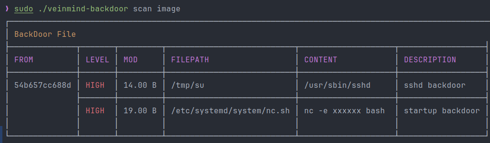
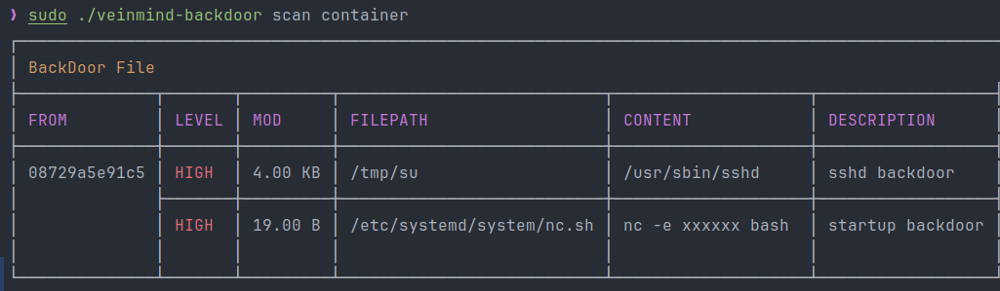
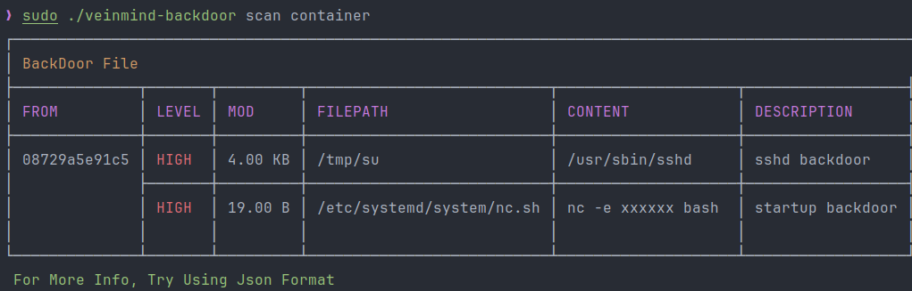
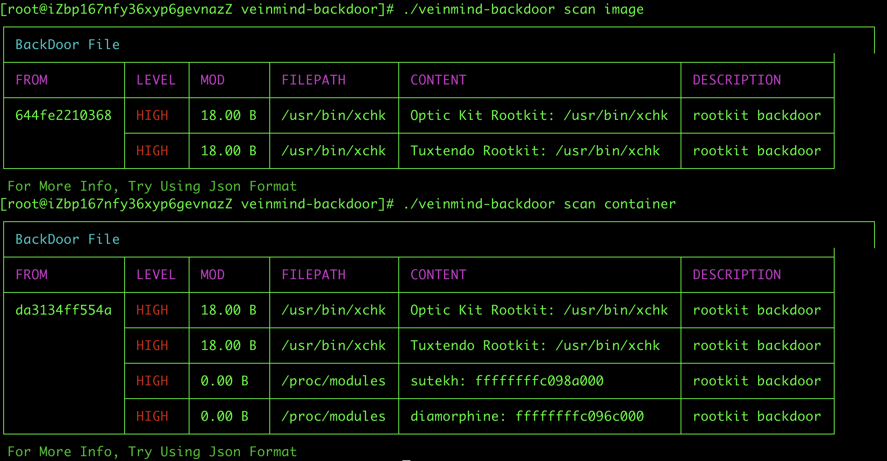

<h1 align="center"> veinmind-backdoor </h1>

<p align="center">
veinmind-backdoor is a container/image backdoor scanning tool developed by Chaitin Technology
</p>

## Features

- Quickly scan containers/images for backdoor risks
- Support `docker`/`containerd` container runtime
- Support multiple report formats such as `JSON`/`CLI`/`HTML`

## check module

- Quickly scan images for backdoors

| Modules        | Functions                                     |
|----------------|-----------------------------------------------|
| bashrc         | Scan bash startup scripts for backdoors       |
| preload        | Scan dynamic link library for backdoors       |
| PROMPT_COMMAND | Scan for PROMPT_COMMAND backdoors             |
| cron           | Scan for backdoors in scheduled tasks         |
| ldsopreload    | Scan ld.so.preload for backdoors              |
| inetd          | Scan inetd configuration files for backdoors  |
| xinetd         | Scan xinetd configuration files for backdoors |
| sshd           | Scan sshd soft link backdoor                  |
| startup        | Scan system startup items for backdoors       |
| tcpWrapper     | Scan for tcpWrapper backdoors                 |
| sshWrapper     | Scan for sshWrapper backdoors                 |
| rootkit        | Scan for rootkit backdoors                 |
## Compatibility

- linux/amd64
- linux/386
- linux/arm64
- linux/arm

## How to use

### Based on the executable

Please install `libveinmind` first, the installation method can refer to [official document](https://github.com/chaitin/libveinmind)
#### Makefile one-key command

```
make run ARG="scan xxx"
```
#### Compile executable files for scanning

Compile the executable
```
make build
```
Run the executable to scan
```
chmod +x veinmind-backdoor && ./veinmind-backdoor scan xxx
```
### Based on parallel container pattern
Make sure `docker` and `docker-compose` are installed on the machine
#### Makefile one-key command
```
make run.docker ARG="scan xxxx"
```
#### Build your own image for scanning
Build the `veinmind-backdoor` image
```
make build.docker
```
Run the container to scan
```
docker run --rm -it --mount 'type=bind,source=/,target=/host,readonly,bind-propagation=rslave' veinmind-backdoor scan xxx
```

## Use parameters

1. Specify the image name or image ID and scan (the corresponding image needs to exist locally)

```
./veinmind-backdoor scan image [imageID/imageName]
```

2. Scan all local mirrors

```
./veinmind-backdoor scan image
```

3. Specify the container name or container ID and scan

```
./veinmind-backdoor scan container [containerID/containerName]
```

4. Scan all local containers

```
./veinmind-backdoor scan container
```

5. Specify the output format
   Supported output formats:
- html
- json
  -cli (default)
```
./veinmind-backdoor scan container [containerID/containerName] -f html
```
The generated result.html effect is as shown in the figure:


## Execution result

Rootkit detection (some features can only detect privilege containers) effect as shown in the figure:

