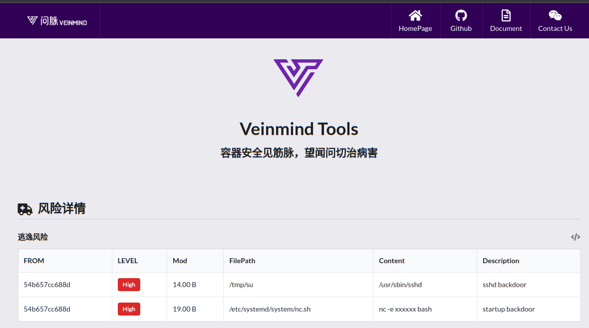

<h1 align="center"> veinmind-backdoor </h1>

<p align="center">
veinmind-backdoor 是由长亭科技自研的一款容器/镜像后门扫描工具 
</p>

## 功能特性

- 快速扫描容器/镜像中的后门风险
- 支持 `docker`/`containerd` 容器运行时
- 支持`JSON`/`CLI`/`HTML`等多种报告格式输出

## 检查模块

- 快速扫描镜像中的后门

| 模块             | 功能                       | 
|----------------|--------------------------|
| bashrc         | 扫描 bash 启动脚本是否包含后门       |
| preload        | 扫描 动态链接库 是否包含后门          |
| PROMPT_COMMAND | 扫描 PROMPT_COMMAND  后门    |
| cron           | 扫描定时任务中是否包含后门            |
| ldsopreload    | 扫描 ld.so.preload 中是否包含后门 |
| inetd          | 扫描 inetd 配置文件中是否包含后门     |
| xinetd         | 扫描 xinetd 配置文件中是否包含后门    |
| sshd           | 扫描 sshd 软链接后门            |
| startup        | 扫描系统启动项中是否包含后门           |
| tcpWrapper     | 扫描 tcpWrapper 后门         |
| sshWrapper     | 扫描 sshWrapper 后门         |
| rootkit        | 扫描 rootkit 后门         |
## 兼容性

- linux/amd64
- linux/386
- linux/arm64
- linux/arm

## 使用方式

### 基于可执行文件

请先安装`libveinmind`，安装方法可以参考[官方文档](https://github.com/chaitin/libveinmind)
#### Makefile 一键命令

```
make run ARG="scan xxx"
```
#### 自行编译可执行文件进行扫描

编译可执行文件
```
make build
```
运行可执行文件进行扫描
```
chmod +x veinmind-backdoor && ./veinmind-backdoor scan xxx 
```
### 基于平行容器模式
确保机器上安装了`docker`以及`docker-compose`
#### Makefile 一键命令
```
make run.docker ARG="scan xxxx"
```
#### 自行构建镜像进行扫描
构建`veinmind-backdoor`镜像
```
make build.docker
```
运行容器进行扫描
```
docker run --rm -it --mount 'type=bind,source=/,target=/host,readonly,bind-propagation=rslave' veinmind-backdoor scan xxx
```

## 使用参数

1.指定镜像名称或镜像ID并扫描 (需要本地存在对应的镜像)

```
./veinmind-backdoor scan image [imageID/imageName]
```

2.扫描所有本地镜像

```
./veinmind-backdoor scan image
```

3.指定容器名称或容器ID并扫描

```
./veinmind-backdoor scan container [containerID/containerName]
```

4.扫描所有本地容器

```
./veinmind-backdoor scan container
```

5.指定输出格式
支持的输出格式：
- html
- json
- cli（默认）
```
./veinmind-backdoor scan container [containerID/containerName] -f html
```
生成的result.html效果如图：



## 运行结果

rootkit检测（部分功能仅能对privilege container进行检测）效果如图：

