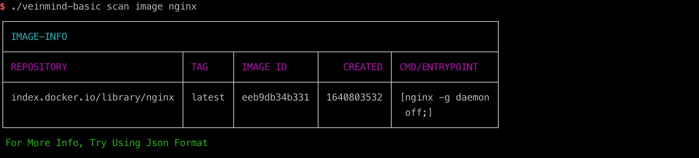
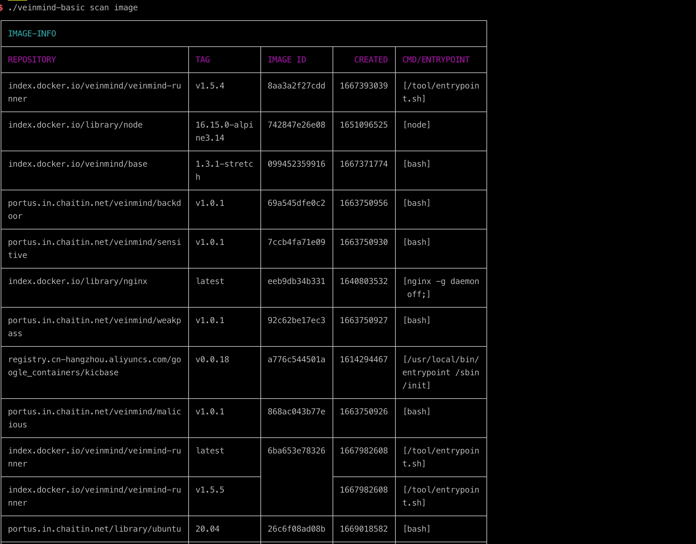
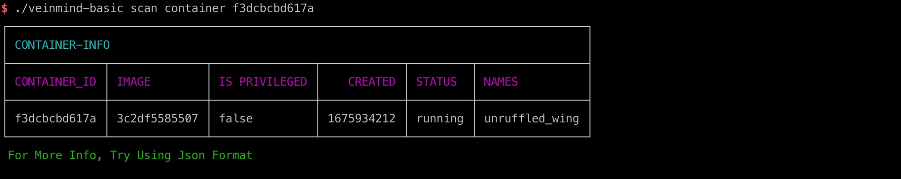
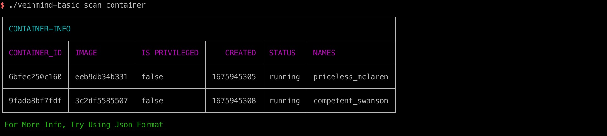
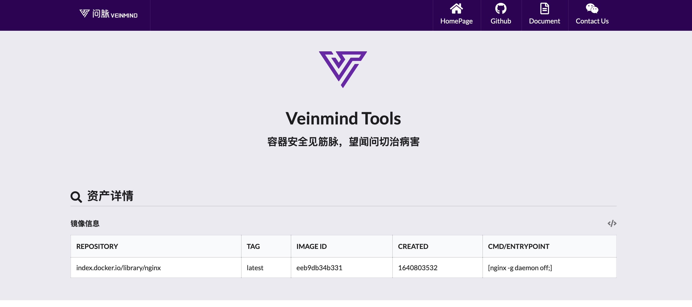

<h1 align="center"> veinmind-basic </h1>

<p align="center">
veinmind-basic is an image/container detailed information scanning tool developed by Changting Technology
</p>

## Features

- Quickly scan the image/container for details
- Supports the 'docker'/' containerd 'container runtime
- Support JSON/CLI/HTML

## Compatibility

- linux/amd64
- linux/386
- linux/arm64
- linux/arm

## Usage

### Based on executable files

Please install ` libveinmind `, installation method can refer to [official documentation] (https://github.com/chaitin/libveinmind)
#### Makefile one-click command

```
make run ARG="scan xxx"
```
#### Compile your own executable file for scanning

Compile the executable
```
make build
```
Run the executable file for scanning
```
chmod +x veinmind-basic && ./veinmind-basic scan xxx
```
### Based on the parallel container pattern
Make sure you have 'docker' and 'docker-compose' installed on your machine
#### Makefile one-click command
```
make run.docker ARG="scan xxxx"
```
#### Build your own image for scanning
Build the 'veinmind-basic' image
```
make build.docker
```
Run the container to scan
```
docker run --rm -it --mount 'type=bind,source=/,target=/host,readonly,bind-propagation=rslave' veinmind-basic scan xxx
```

## Use parameters

1. Specify the image name or image ID and scan (if the image exists locally)

```
./veinmind-basic scan image [imagename/imageid]
```


2. Scan all local images

```
./veinmind-basic scan image
```


3. Specify the container name or ID and scan (if the corresponding container exists locally)
```
./veinmind-basic scan container [containerName/containerid]
```


4. Scan all local containers
```
./veinmind-basic scan container
```


Specify the output type
Supported output formats:
- html
- json
- cli (default)
```
./veinmind-basic scan image [imageID/imageName] -f html
```
The resulting result.html looks like this:
