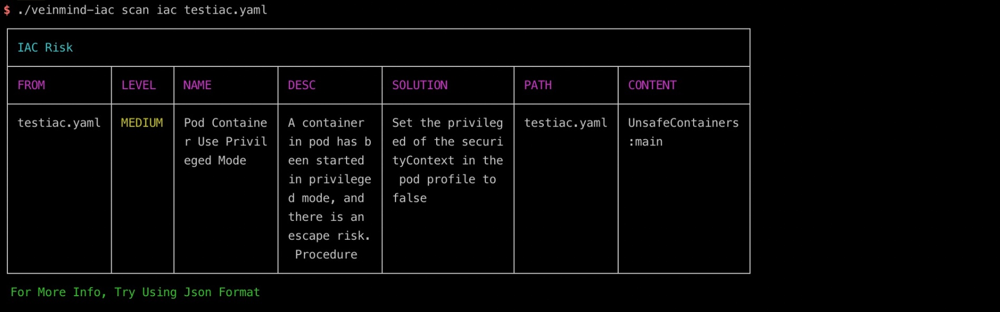
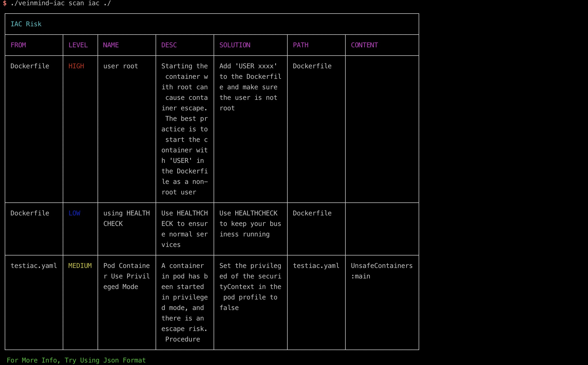
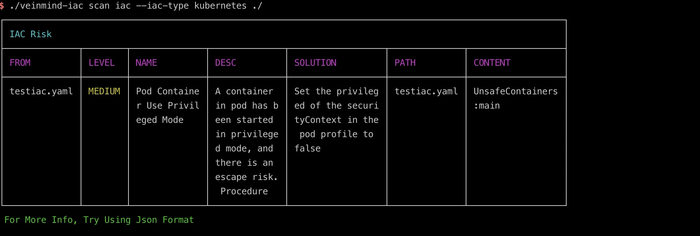
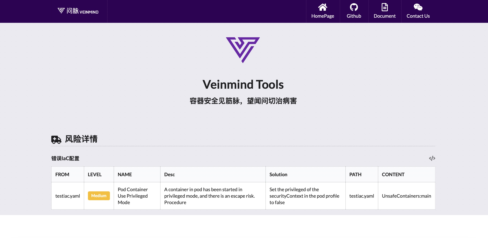

<h1 align="center"> veinmind-iac </h1>

<p align="center">
veinmind-iac is used to scan Infrastructure as Code (IaC) files for risk issues
</p>

## Features

- Supports' dockerfile/kubernetes' IaC type files
- Support automatic recursive scanning of specified directories

## Compatibility

- linux/amd64
- linux/386
- linux/arm64
## Usage

### Based on executable files

Please install ` libveinmind `, installation method can refer to [official documentation] (https://github.com/chaitin/libveinmind)
#### Makefile one-click command

```
make run ARG="scan xxx"
```
#### Compile your own executable file for scanning

Compile the executable
```
make build
```
Run the executable file for scanning
```
chmod +x veinmind-iac && ./veinmind-iac scan xxx
```
### Based on the parallel container pattern
Make sure you have 'docker' and 'docker-compose' installed on your machine
#### Makefile one-click command
```
make run.docker ARG="scan xxxx"
```
#### Build your own image for scanning
Build the 'veinmind-iac' image
```
make build.docker
```
Run the container to scan
```
docker run --rm -it --mount 'type=bind,source=/,target=/host,readonly,bind-propagation=rslave' veinmind-iac scan xxx
```

## Use parameters

1. Specify the IaC file to scan

```
./veinmind-iac scan iac IACFILE
```



2. Specify the types of IaC files that may exist in the scan directory

```
./veinmind-iac scan iac PATH
```


3. Specify a specific IaC file type to scan

```
./veinmind-iac scan iac --iac-type kubernetes/dockerfile IACFILE/PATH
```


Specify the output format
Supported output formats:
- html
- json
- cli (default)
```
./veinmind-iac scan iac -f html IACFILE/PATH
```
The resulting result.html looks like this:

