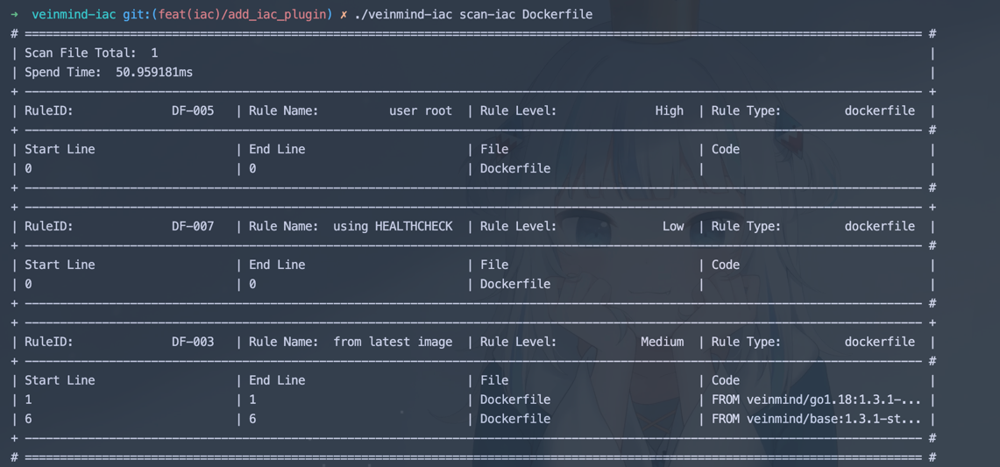
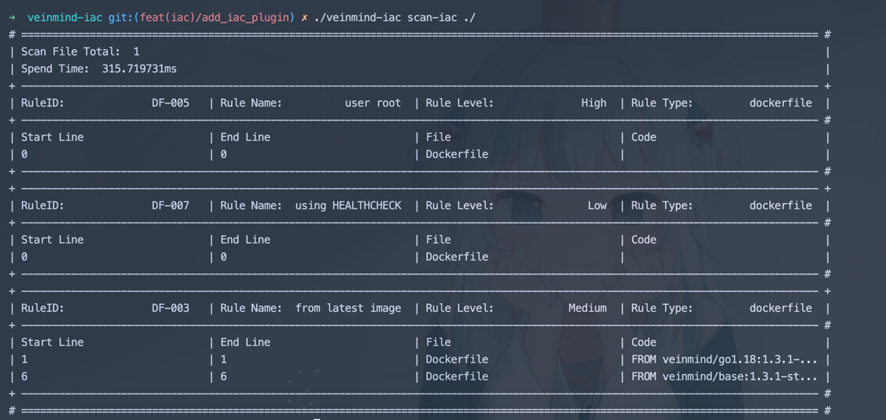
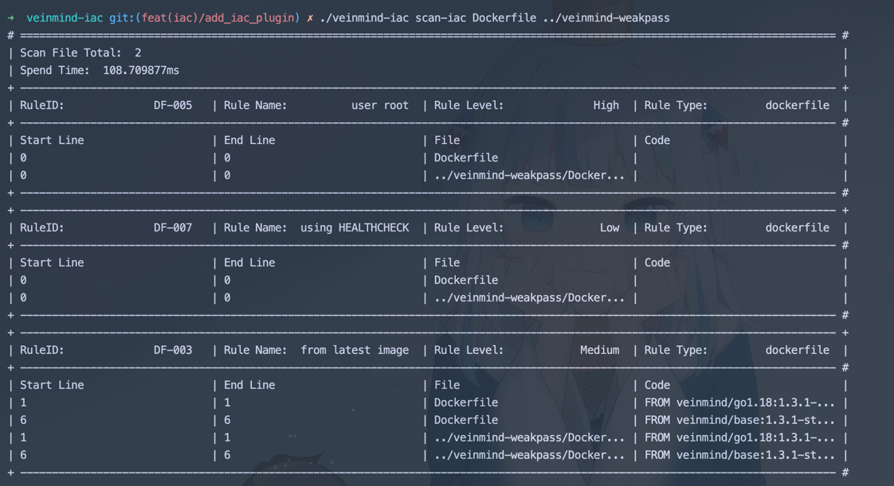
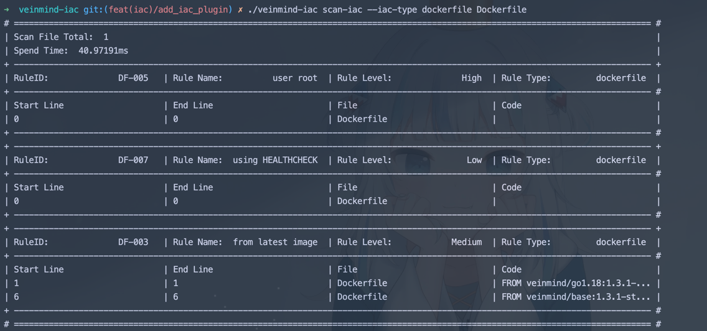
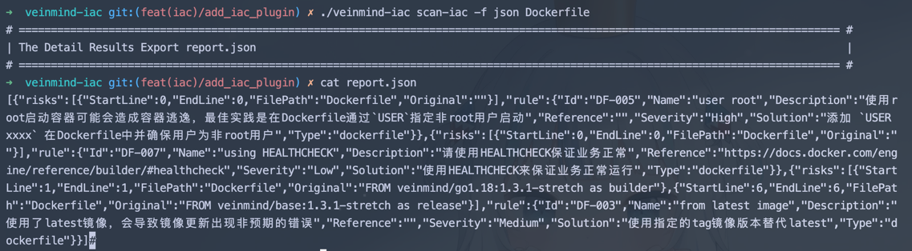

<h1 align="center"> veinmind-iac </h1>

<p align="center">
veinmind-iac 用于扫描IaC(Infrastructure as Code) 文件内的风险问题
</p>

## 功能特性

- 支持 `dockerfile/kubernetes` IaC类型文件
- 支持指定目录自动递归扫描

## 兼容性

- linux/amd64
- linux/386
- linux/arm64

## 开始之前

### 安装方式一

请先安装`libveinmind`，安装方法可以参考[官方文档](https://github.com/chaitin/libveinmind)

### 安装方式二

基于平行容器的模式，获取 `veinmind-iac ` 的镜像并启动

```
docker run --rm -it --mount 'type=bind,source=/,target=/host,readonly,bind-propagation=rslave' veinmind-iac scan-iac
```

或者使用项目提供的脚本启动

```
chmod +x parallel-container-run.sh && ./parallel-container-run.sh scan-iac
```

### 使用参数

1. 指定扫描IaC文件

```
./veinmind-iac scan-iac IACFILE
```



2. 指定扫描目录下可能存在的IaC文件类型

```
./veinmind-iac scan-iac PATH
```

3. 也可也混合使用

```
./veinmind-iac scan-iac IACFILE PATH
```



4. 指定扫描特定的IaC文件类型

```
./veinmind-iac scan-iac --iac-type dockerfile IACFILE/PATH
```


5. 出结果至json文件

```
./veinmind-iac scan-iac -f json IACFILE/PATH
```

