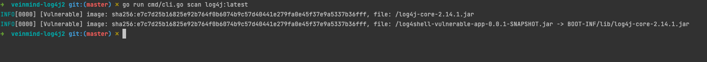

<h1 align="center"> veinmind-log4j2 </h1>

<p align="center">
veinmind-log4j2 主要用于扫描容器镜像存在的 CVE-2021-44228 漏洞的 log4j jar 文件。
</p>

## 功能特性

- 支持 fat jar、jar 中包含 jar 等情况的检测

## 使用

1.指定镜像名称或镜像ID并扫描 (需要本地存在对应的镜像)

```
./veinmind-log4j2 scan-image [imagename/imageid]
```



2.扫描本地全部镜像

```
./veinmind-log4j2 scan-image 
```

3.扫描本地容器

```
./veinmind-log4j2 scan-container [containerId]
```