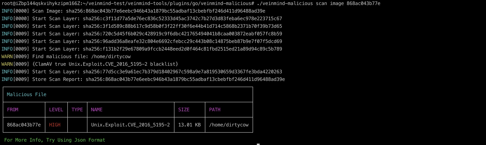
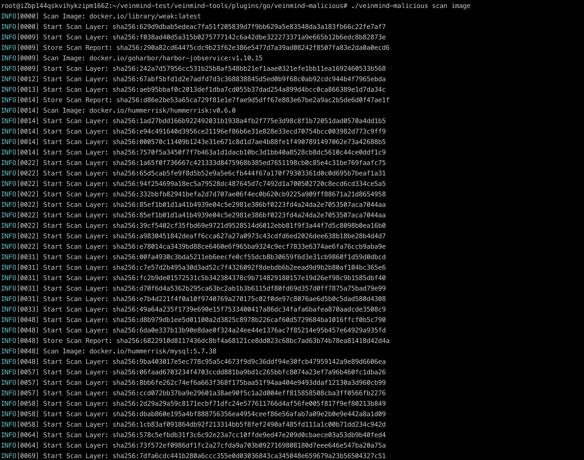
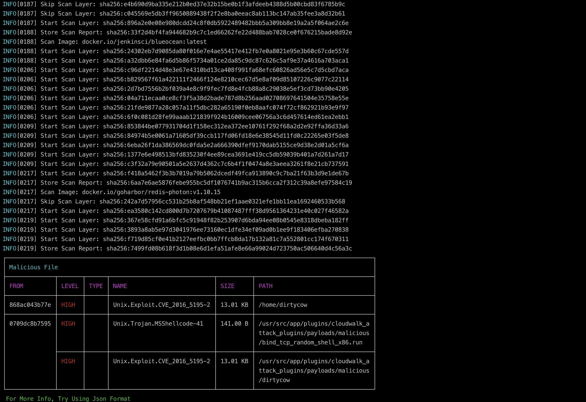
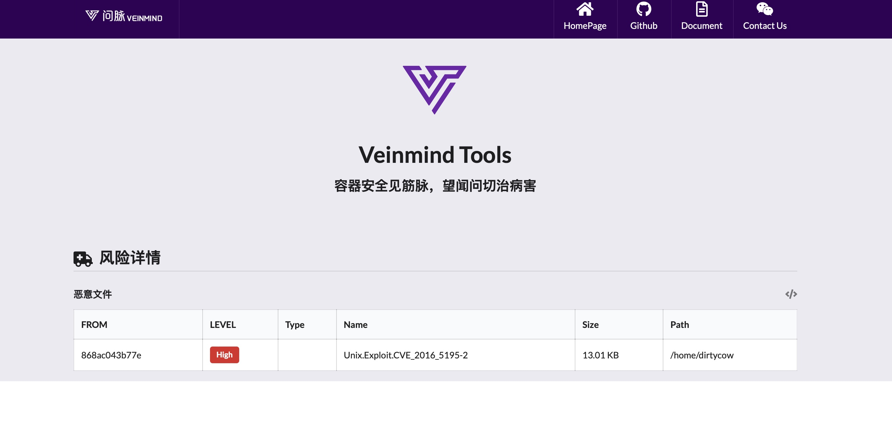

<h1 align="center"> veinmind-malicious </h1>

<p align="center">
veinmind-malicious is a mirror malicious file scanning tool developed by Changting Technology
</p>

## Features

- Quickly scan images for malicious files (ClamAV and VirusTotal are currently supported)
- Supports the 'docker'/' containerd 'container runtime
- Support JSON/CLI/HTML

## Compatibility

- linux/amd64
- linux/386
- linux/arm64
- linux/arm

## Usage

### Based on executable files

Please install ` libveinmind `, installation method can refer to [official documentation] (https://github.com/chaitin/libveinmind)
#### Makefile one-click command

```
make run ARG="scan xxx"
```
#### Compile your own executable file for scanning

Compile the executable
```
make build
```
Run the executable file for scanning
```
chmod +x veinmind-malicious && ./veinmind-malicious scan xxx
```
### Based on the parallel container pattern
Make sure you have 'docker' and 'docker-compose' installed on your machine
#### Makefile one-click command
```
make run.docker ARG="scan xxxx"
```
#### Build your own image for scanning
Build the 'veinmind-malicious' image
```
make build.docker
```
Run the container to scan
```
docker run --rm -it --mount 'type=bind,source=/,target=/host,readonly,bind-propagation=rslave' veinmind-malicious scan  xxx
```

## Use parameters

1. Specify the image name or image ID and scan (if the image exists locally)

```
./veinmind-malicious scan image [imagename/imageid]
```

2. Scan all local images

```
./veinmind-malicious scan image
```





3. Specify the output report format
   Supported output formats:
- html
- json
- cli (default)

```
./veinmind-malicious scan image -f html
```

