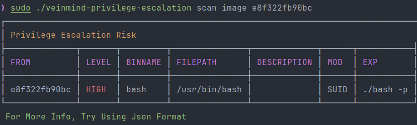
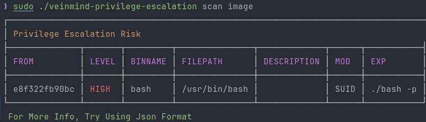
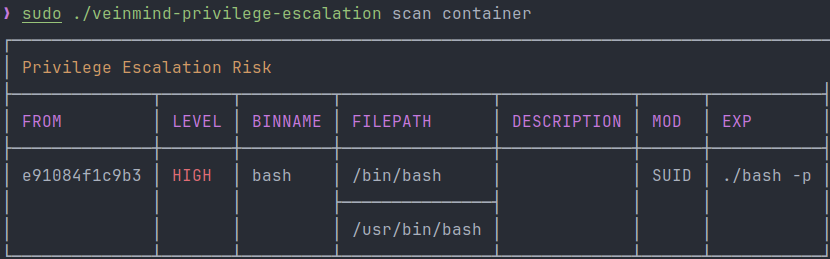

<h1 align="center"> veinmind-privilege-escalation </h1>

<p align="center">
veinmind-privilege-escalation is a privilege escalation risk scanning tool developed by Chaitin Technology
</p>

## Features

> A plug-in that detects the risk of privilege escalation in container escape scenarios. The specific security policy comes from `https://github.com/GTFOBins/GTFOBins.github.io`

- Quickly scan containers/images for privilege escalation risks
    - [x] suid
    - [x] limited-suid
    - [x] sudo
    - [ ] capabilities
- Support `docker`/`containerd` container runtime
- Support multiple report formats such as `JSON`/`CLI`/`HTML`

## Compatibility

- linux/amd64
- linux/386
- linux/arm64
- linux/arm

## How to use

### Based on the executable

Please install `libveinmind` first, the installation method can refer to [official document](https://github.com/chaitin/libveinmind)
#### Makefile one-key command

```
make run ARG="scan xxx"
```
#### Compile executable files for scanning

Compile the executable
```
make build
```
Run the executable to scan
```
chmod +x veinmind-privilege-escalation && ./veinmind-privilege-escalation scan xxx
```
### Based on parallel container pattern
Make sure `docker` and `docker-compose` are installed on the machine
#### Makefile one-key command
```
make run.docker ARG="scan xxxx"
```
#### Build your own image for scanning
Build the `veinmind-privilege-escalation` image
```
make build.docker
```
Run the container to scan
```
docker run --rm -it --mount 'type=bind,source=/,target=/host,readonly,bind-propagation=rslave' veinmind-privilege-escalation scan xxx
```

## Use parameters

1. Specify the image name or image ID and scan (the corresponding image needs to exist locally)

```
./veinmind-privilege-escalation scan image [imageID/imageName]
```


2. Scan all local mirrors

```
./veinmind-privilege-escalation scan image
```


3. Specify the container name or container ID and scan

```
./veinmind-privilege-escalation scan container [containerID/containerName]
```


4. Scan all local containers

```
./veinmind-privilege-escalation scan container
```


5. Specify the output format
   Supported output formats:
- html
- json
  -cli (default)
```
./veinmind-privilege-escalation scan container [containerID/containerName] -f html
```
The generated result.html effect is as shown in the figure:

