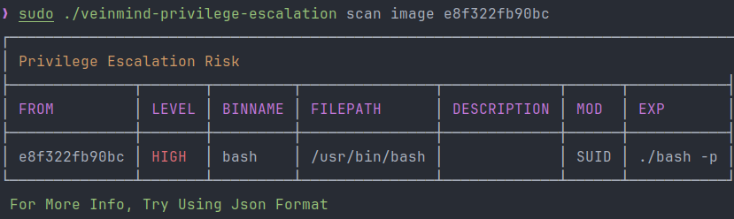
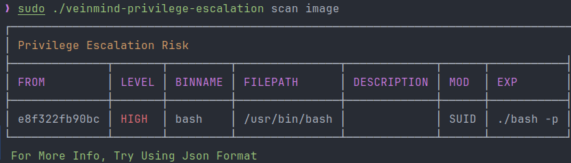
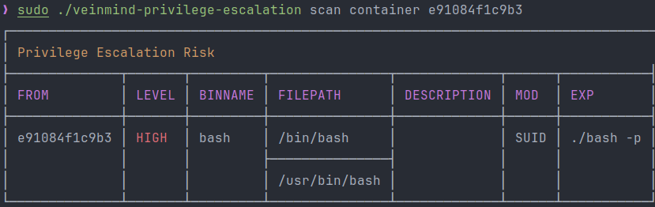
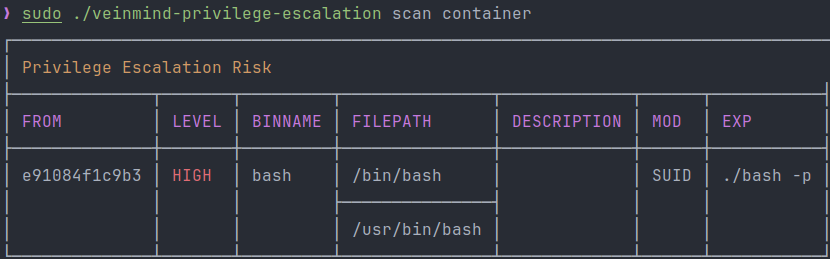
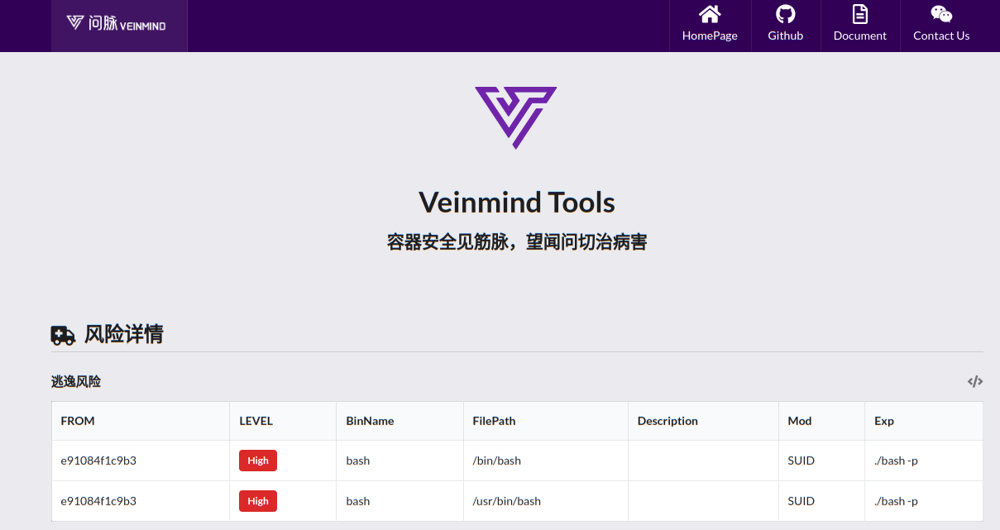

<h1 align="center"> veinmind-privilege-escalation </h1>

<p align="center">
veinmind-privilege-escalation 是由长亭科技自研的一款提权风险扫描工具 
</p>

## 功能特性

> 检测容器逃逸场景提权风险的插件，具体的安全策略来自`https://github.com/GTFOBins/GTFOBins.github.io`

- 快速扫描容器/镜像中的提权风险
  - [x] suid
  - [x] limited-suid
  - [x] sudo
  - [ ] capabilities
- 支持 `docker`/`containerd` 容器运行时
- 支持`JSON`/`CLI`/`HTML`等多种报告格式输出

## 兼容性

- linux/amd64
- linux/386
- linux/arm64
- linux/arm

## 使用方式

### 基于可执行文件

请先安装`libveinmind`，安装方法可以参考[官方文档](https://github.com/chaitin/libveinmind)
#### Makefile 一键命令

```
make run ARG="scan xxx"
```
#### 自行编译可执行文件进行扫描

编译可执行文件
```
make build
```
运行可执行文件进行扫描
```
chmod +x veinmind-privilege-escalation && ./veinmind-privilege-escalation scan xxx 
```
### 基于平行容器模式
确保机器上安装了`docker`以及`docker-compose`
#### Makefile 一键命令
```
make run.docker ARG="scan xxxx"
```
#### 自行构建镜像进行扫描
构建`veinmind-privilege-escalation`镜像
```
make build.docker
```
运行容器进行扫描
```
docker run --rm -it --mount 'type=bind,source=/,target=/host,readonly,bind-propagation=rslave' veinmind-privilege-escalation scan xxx
```

## 使用参数

1.指定镜像名称或镜像ID并扫描 (需要本地存在对应的镜像)

```
./veinmind-privilege-escalation scan image [imageID/imageName]
```


2.扫描所有本地镜像

```
./veinmind-privilege-escalation scan image
```


3.指定容器名称或容器ID并扫描

```
./veinmind-privilege-escalation scan container [containerID/containerName]
```


4.扫描所有本地容器

```
./veinmind-privilege-escalation scan container
```


5.指定输出格式
支持的输出格式：
- html
- json
- cli（默认）
```
./veinmind-privilege-escalation scan container [containerID/containerName] -f html
```
生成的result.html效果如图：


