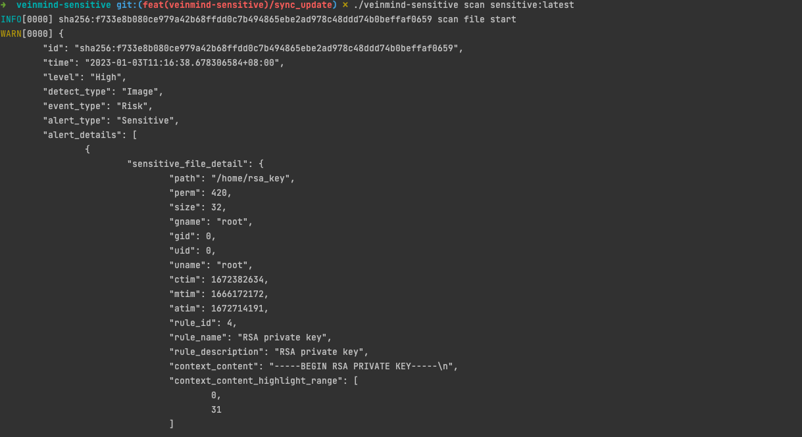
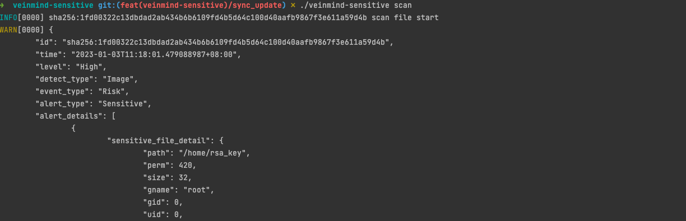

<h1 align="center"> veinmind-sensitive </h1>

<p align="center">
veinmind-sensitive is an image sensitive information scanning tool developed by Chaitin Technology 
</p>

## Features

- Quickly scan images for sensitive information
- Support custom sensitive information scanning rules
- Support container runtime `containerd` and `dockerd`

## Compatibility

- linux/amd64
- linux/386
- linux/arm64
- linux/arm

## Prepare

### install by package manager

1. install `libveinmind` first ，you can click here [offical document](https://github.com/chaitin/libveinmind) for more
   info

### install by parallel container

1. Install by Parallel Container，pull `veinmind-sensitive` image and start
    ```
    docker run --rm -it --mount 'type=bind,source=/,target=/host,readonly,bind-propagation=rslave' veinmind/veinmind-sensitive-go
    ```
2. or start with the script which we provided
    ```
    chmod +x parallel-container-run.sh && ./parallel-container-run.sh
    ```

## How to use

1. Scan image with specified image name or ID(need to have a corresponding image locally)

    ```
    ./veinmind-sensitive scan [imagename/imageid]
    ```

2. Scan all local images

    ```
    ./veinmind-sensitive scan
    ```

3. Specify the container runtime type
    ```
    ./veinmind-sensitive scan --containerd
    ```

   container runtime type
    - dockerd
    - containerd

4. Specify output type
    ```
    ./veinmind-sensitive --output [outputtype] scan
    ```

## Rule Field Description

- id: rule identifier
- description: rule description
- match: content matching rules, the default is regular
- filepath: path matching rules, the default is regular
- env: environment variable matching rules, the default is regular and ignores case

## Demo

1. Scan the image which name is `sensitive`
   

2. Scan all local images
   