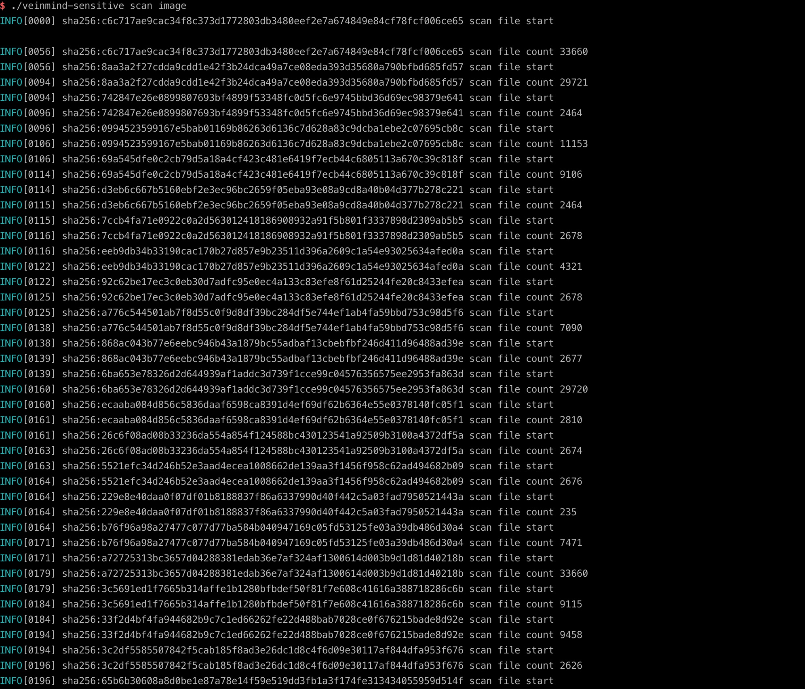
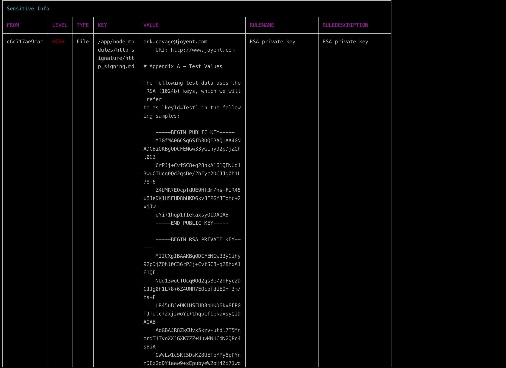

<h1 align="center"> veinmind-sensitive </h1>

<p align="center">
veinmind-sensitive 是由长亭科技自研的一款镜像敏感信息扫描工具 
</p>

## 功能特性

- 快速扫描镜像中的敏感信息
- 支持敏感信息扫描规则自定义
- 支持`containerd`/`dockerd`镜像文件系统弱口令扫描

## 兼容性

- linux/amd64
- linux/386
- linux/arm64
- linux/arm

## 使用方式

### 基于可执行文件

请先安装`libveinmind`，安装方法可以参考[官方文档](https://github.com/chaitin/libveinmind)
#### Makefile 一键命令

```
make run ARG="scan xxx"
```
#### 自行编译可执行文件进行扫描

编译可执行文件
```
make build
```
运行可执行文件进行扫描
```
chmod +x veinmind-sensitive && ./veinmind-sensitive scan xxx 
```
### 基于平行容器模式
确保机器上安装了`docker`以及`docker-compose`
#### Makefile 一键命令
```
make run.docker ARG="scan xxxx"
```
#### 自行构建镜像进行扫描
构建`veinmind-sensitive`镜像
```
make build.docker
```
运行容器进行扫描
```
docker run --rm -it --mount 'type=bind,source=/,target=/host,readonly,bind-propagation=rslave' veinmind-sensitive scan xxx
```

## 使用参数

1.指定镜像名称或镜像ID并扫描 (需要本地存在对应的镜像)

```
./veinmind-sensitive scan image [imagename/imageid]
```


2.扫描所有本地镜像

```
./veinmind-sensitive scan image
```



3.指定输出类型
支持的输出格式：
- html
- json
- cli（默认）
```
./veinmind-sensitive scan image [imageID/imageName] -f html
```
生成的result.html效果如图：


## 规则字段说明

- id: 规则标识符
- description: 规则描述
- match: 内容匹配规则，默认为正则
- filepath: 路径匹配规则，默认为正则
- env: 环境变量匹配规则，默认为正则且忽略大小写
