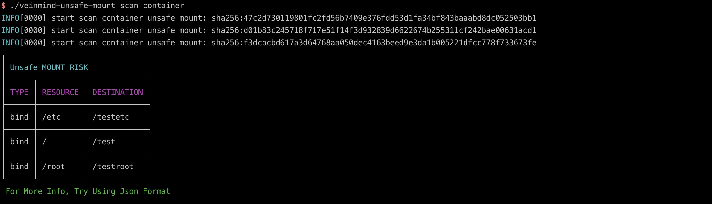
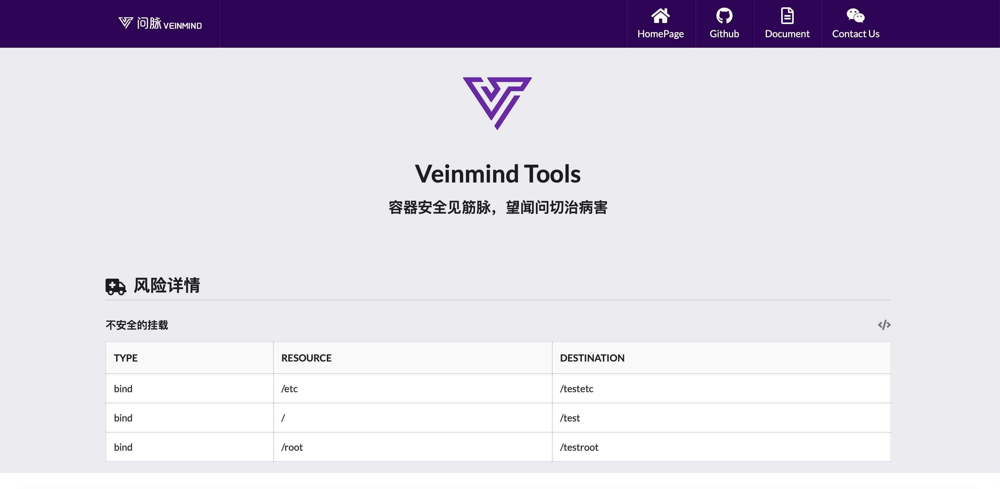

<h1 align="center"> veinmind-unsafe-mount </h1>

<p align="center">
veinmind-unsafe-mount 是由长亭科技自研的一款容器不安全挂载目录扫描工具 
</p>

## 功能特性

- 快速扫描容器中的不安全挂载
- 支持`containerd`/`dockerd`容器运行时

## 兼容性

- linux/amd64
- linux/386
- linux/arm64

## 使用方式

### 基于可执行文件

请先安装`libveinmind`，安装方法可以参考[官方文档](https://github.com/chaitin/libveinmind)
#### Makefile 一键命令

```
make run ARG="scan xxx"
```
#### 自行编译可执行文件进行扫描

编译可执行文件
```
make build
```
运行可执行文件进行扫描
```
chmod +x veinmind-unsafe-mount && ./veinmind-unsafe-mount scan xxx 
```
### 基于平行容器模式
确保机器上安装了`docker`以及`docker-compose`
#### Makefile 一键命令
```
make run.docker ARG="scan xxxx"
```
#### 自行构建镜像进行扫描
构建`veinmind-unsafe-mount`镜像
```
make build.docker
```
运行容器进行扫描
```
docker run --rm -it --mount 'type=bind,source=/,target=/host,readonly,bind-propagation=rslave' veinmind-unsafe-mount scan xxx
```

## 使用参数

1. 指定容器名称或容器ID并扫描 (需要本地存在对应的容器)
```
./veinmind-unsafe-mount scan container [containerID/containerName]
```

2. 扫描所有本地容器
```
./veinmind-unsafe-mount scan container
```

3. 指定输出格式
支持的输出格式：
- html
- json
- cli（默认）
```
./veinmind-unsafe-mount scan container [containerID/containerName] -f html
```
生成的result.html效果如图：

