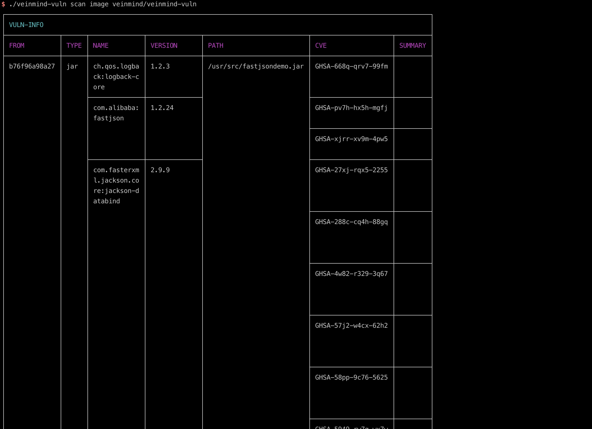
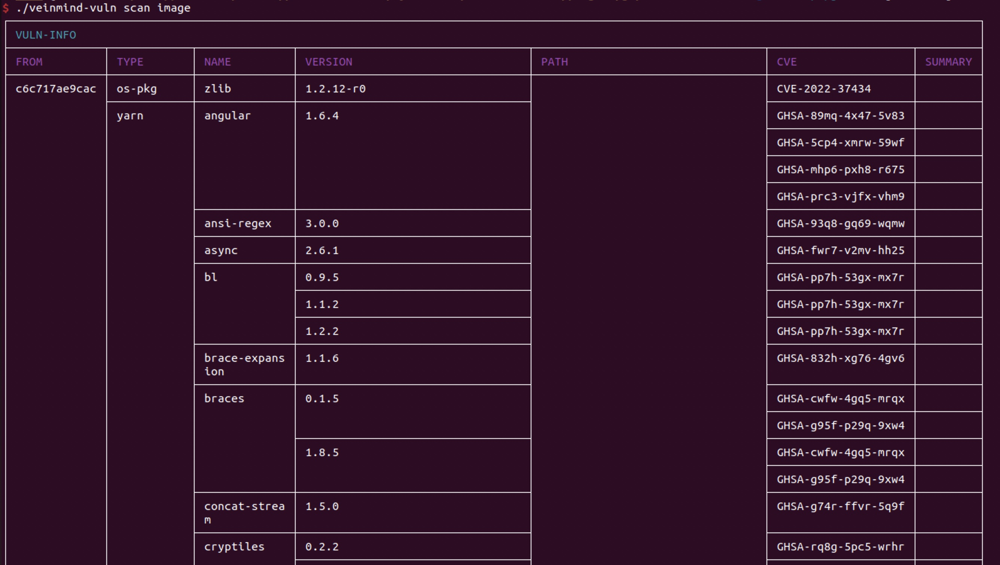
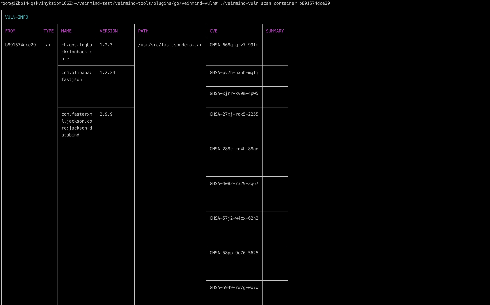
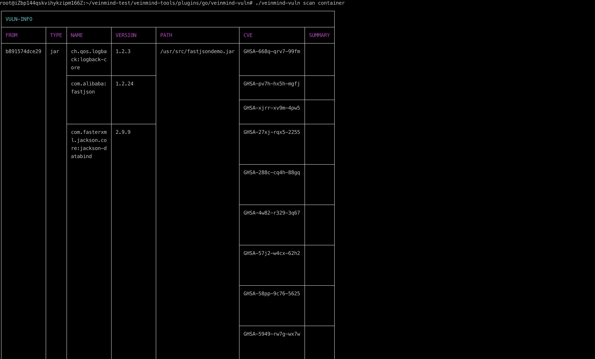
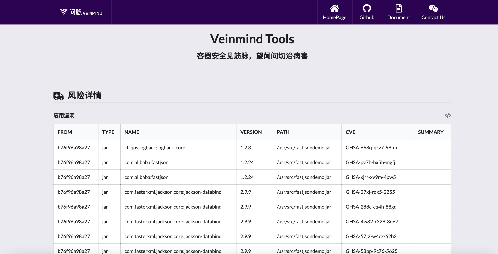
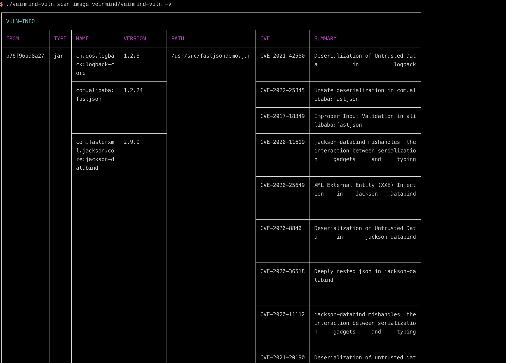
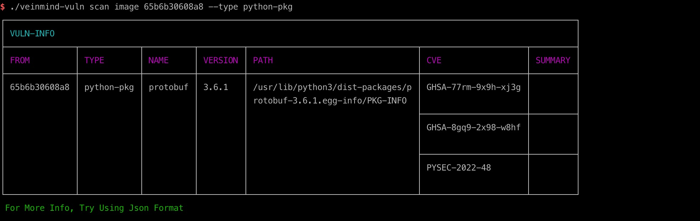
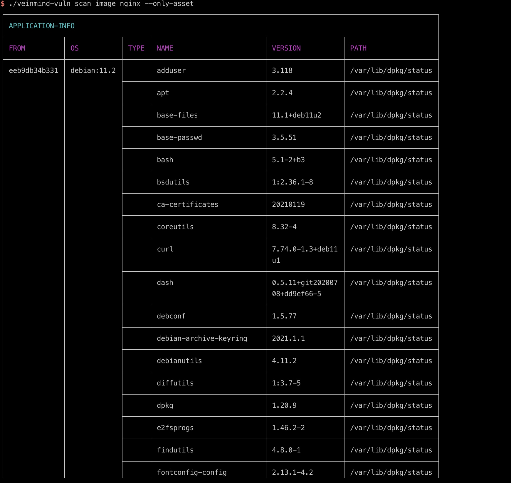

<h1 align="center"> veinmind-vuln </h1>

<p align="center">
veinmind-vuln is used to scan container/images for internal assets and vulnerability information </p>

## Features

- Scan the image/container for OS information
- Scan images/containers for system-installed packages
- Scan the image/container for libraries installed in the app
- Scan images/containers for known Cves (beta)

## Compatibility

- linux/amd64
- linux/386
- linux/arm64
- linux/arm

## Usage

### Based on executable files

Please install ` libveinmind `, installation method can refer to [official documentation] (https://github.com/chaitin/libveinmind)
#### Makefile one-click command

```
make run ARG="scan xxx"
```
#### Compile your own executable file for scanning

Compile the executable
```
make build
```
Run the executable file for scanning
```
chmod +x veinmind-vuln && ./veinmind-vuln scan xxx
```
### Based on the parallel container pattern
Make sure you have 'docker' and 'docker-compose' installed on your machine
#### Makefile one-click command
```
make run.docker ARG="scan xxxx"
```
#### Build your own image for scanning
Build the 'veinmind-vuln' image
```
make build.docker
```
Run the container to scan
```
docker run --rm -it --mount 'type=bind,source=/,target=/host,readonly,bind-propagation=rslave' veinmind-vuln scan xxx
```

## Use parameters

1. Specify the image name or image ID and scan (if the image exists locally)

```
./veinmind-vuln scan image [imageID/imageName]
```

2. Scan all local images

```
./veinmind-vuln scan image
```

3. Specify the container name or container ID and scan

```
./veinmind-vuln scan container [containerID/containerName]
```


4. Scan all local containers

```
./veinmind-vuln scan container
```


Specify the output format
Supported output formats:
- html
- json
- cli (default)
```
./veinmind-vuln scan image [imageID/imageName] -f html
```
The resulting result.html looks like this:

6. Show details
```
./veinmind-vuln scan image [imageID/imageName] -v
```

7. Display specific types of information
```
./veinmind-vuln scan image [imageID/imageName] --type [os/python/npm/jar.....]
```



8. Scan only asset information
```
./veinmind-vuln scan image [imageID/imageName] --only-asset
```
