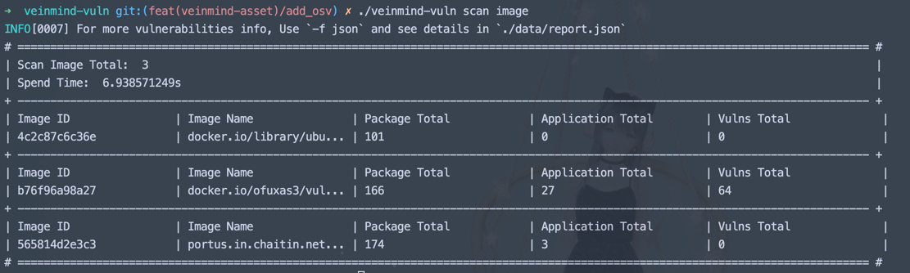
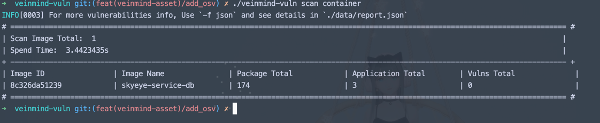
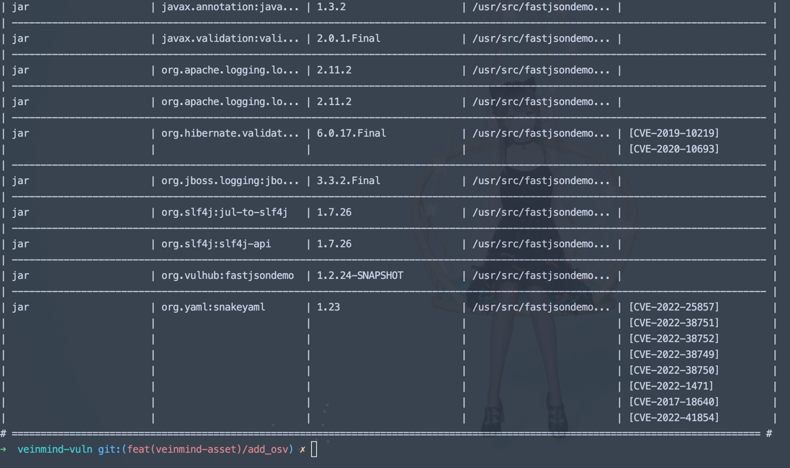
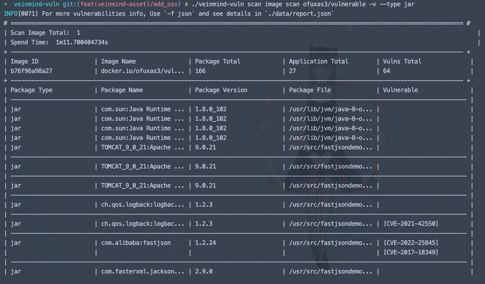
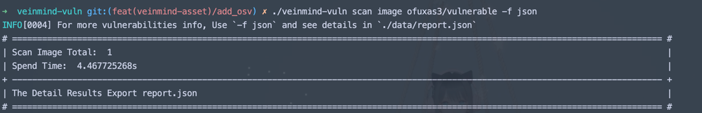
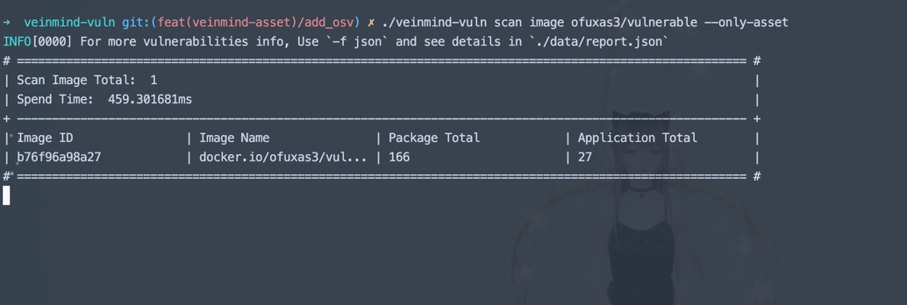

<h1 align="center"> veinmind-vuln </h1>

<p align="center">
veinmind-vuln is mainly used to scan the internal assets information and vulnerabilities of images and containers
</p>

## Features

- Scan image/container OS information
- Scan the packages information installed in image/container
- Scan the libraries installed by the application in image/container
- Scan the CVE vulnerabilities in image/container (beta)

## How to use

### Base Command

```
./veinmind-vuln scan image/container [image_name/image_id/container_name/container_id]
```

### User Options

| Options Name                                      | Meaning                                | Must                      |
|---------------------------------------------------|----------------------------------------|---------------------------|
| image/container                                   | scan object is image or container      | true                      |
| [image_name/image_id/container_name/container_id] | scan image's or container's name or id | false(default all)        |
| -v                                                | show details                           | false(default no details) |
| -f [csv/json/stdout]                              | appoint output: csv/json/stdout        | false(default stdout)     |
| --type [os/python/jar/pip/npm...]                 | appoint asset type: os/python/jar/...  | false(default all)        |
| --only-asset                                      | do not scan vulns info                 | false(default off)        |

### Example

1. Scan all local images

```
./veinmind-vuln scan image
```


2. Scan all local containers

```
./veinmind-vuln scan container
```


3. Scan image and show details(extends vulns details)

```
./veinmind-vuln scan image [imagename/imageid] -v
```


4. Scan image and show details with specified type results

```
./veinmind-vuln scan image [imagename/imageid] -v --type [os/python/jar/pip/npm.......]
```


5. Output detailed results to file

```
./veinmind-vuln scan image [imagename/imageid] -f [csv/json]
```


6. Only Scan Assets info

```
./veinmind-vuln scan image [imagename/imageid] --only-asset
```

