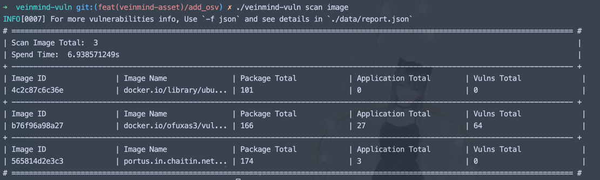
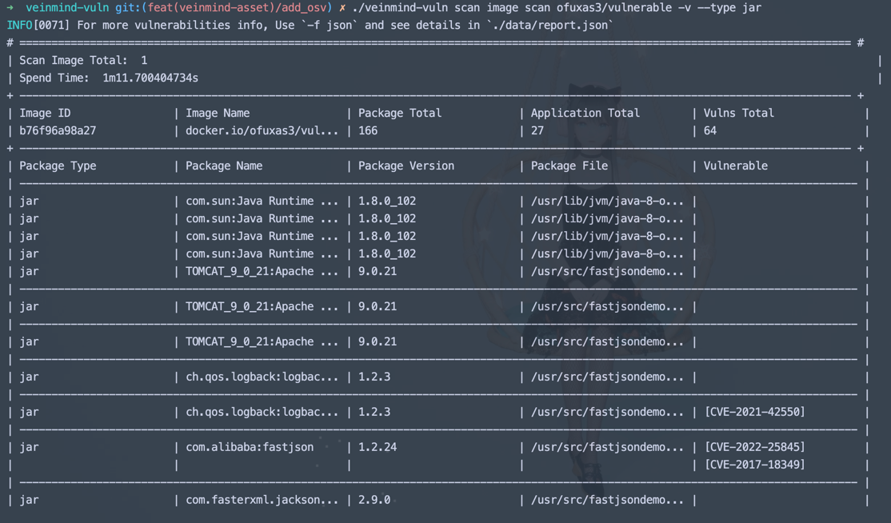
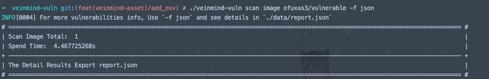
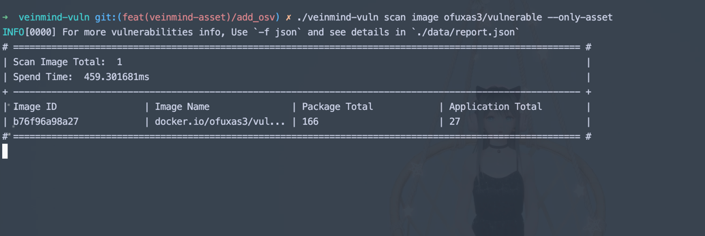

<h1 align="center"> veinmind-vuln </h1>

<p align="center">
veinmind-vuln 用于扫描容器镜像的内资产和漏洞信息
</p>

## 功能特性

- 扫描镜像/容器的OS信息
- 扫描镜像/容器内系统安装的packages
- 扫描镜像/容器内应用安装的libraries
- 扫描镜像/容器是否存在已知cve (beta)

## 使用

### 基本命令

```
./veinmind-vuln scan image/container [image_name/image_id/container_name/container_id]
```

### 可选参数
| 参数名称                                              | 含义                          | 是否必填          |
|---------------------------------------------------|-----------------------------|---------------|
| image/container                                   | 选择扫描对象为镜像/容器                | 是             |
| [image_name/image_id/container_name/container_id] | 扫描镜像/容器的名称/ID               | 否(不填写时默认扫描全部) |
| -v                                                | 是否显示详细信息                    | 否(默认为不展示详情)   |
| -f [csv/json/stdout]                              | 指定输出模式: csv/json/控制台        | 否(默认为stdout)  |
| --type [os/python/jar/pip/npm...]                 | 指定资产类型: 系统os/python/jar/... | 否(默认全部)       |
| --only-asset                                      | 仅扫描资产信息(不扫描漏洞）              | 否(默认不开启)      |

### 示例

1. 扫描本地全部镜像

```
./veinmind-vuln scan image
```


2. 扫描本地全部容器

```
./veinmind-vuln scan container
```


3. 输出详细结果(包含漏洞详情)

```
./veinmind-vuln scan image [imagename/imageid] -v
```


4. 输出指定类型的详细结果

```
./veinmind-vuln scan image [imagename/imageid] -v --type [os/python/jar/pip/npm.......]
```



5. 输出详细结果到文件

```
./veinmind-vuln scan image [imagename/imageid] -f [csv/json]
```



6. 仅扫描资产信息

```
./veinmind-vuln scan image [imagename/imageid] --only-asset
```

