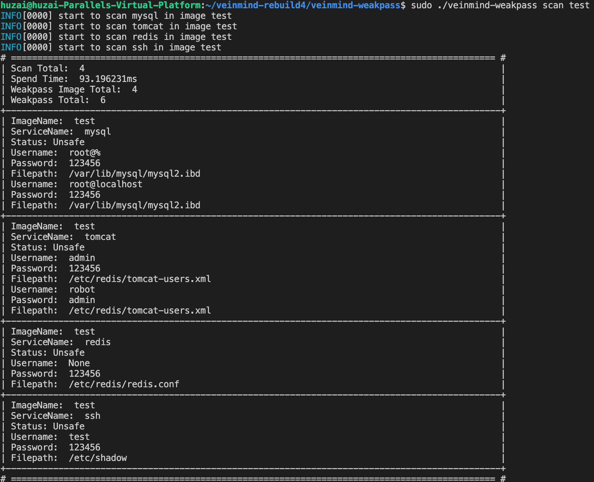
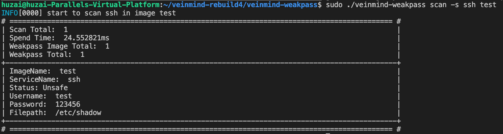
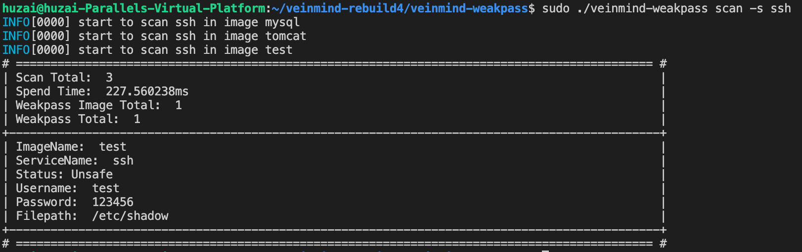

<h1 align="center"> veinmind-weakpass </h1>

<p align="center">
veinmind-weakpass is a weak password scanning tool for image developed by Chaitin Technology
</p>

## Features

- Quickly scan the weak password in image
- Support weak password macro definition
- Support concurrent scanning for weak passwords
- Support custom username and dictionary
- Support container runtime `containerd` and `dockerd`

## compatibility

- linux/amd64
- linux/386
- linux/arm64
- linux/arm

## Prepare

### install by package manager 

-  install `libveinmind`  firstlly ，you can click here [offical document](https://github.com/chaitin/libveinmind) for more info

### install by parallel container
- Install by Parallel Container，pull `veinmind-weakpass` iamge  and start
    ```
    docker run --rm -it --mount 'type=bind,source=/,target=/host,readonly,bind-propagation=rslave' veinmind/veinmind-weakpass scan image
    ```
- or start with the script which we provided
    ```
    chmod +x parallel-container-run.sh && ./parallel-container-run.sh scan image
    ```

## How to use

1. Scan image with specified image name or ID(need to have a corresponding image locally)
    ```
    ./veinmind-weakpass scan image [imagename/imageid]
    ```
   
2. Scan container with specified container name or ID(need to have a corresponding container locally)
    ```
    ./veinmind-weakpass scan container [imagename/imageid]
    ```


3. Scan all local images

    ```
    ./veinmind-weakpass scan image
    ```

4. Specify container runtime type
    ```
    ./veinmind-weakpass scan image --containerd
    ```

    container runtime type
    - dockerd
    - containerd

5. Specify the username which you want to scan
    ```
    ./veinmind-weakpass scan image -u username
    ```

6. Specify the custom dict
    ```
    ./veinmind-weakpass scan image -d ./pass.dict
    ```
7. Specify the services name
    ```
    ./veinmind-weakpass scan image -a ssh,mysql,redis
    ```
    - support these service currently

        | serverName | version |
        |:----------:|:-------:|
        |     ssh    |   all   |
        |    mysql   |   8.X   |
        |    redis   |   all   |
        |   tomcat   |   all   |

8. Extract default dictionary to local disk
    ```
    ./veinmind-weakpass extract
    ```

## Demo
1.  Scan the image which name is `test` and all service supported

2. Specify the image `test` and scan `ssh` service in the image

2. Scan `ssh` service in all images

