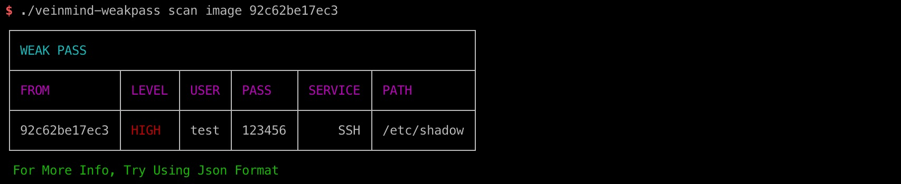
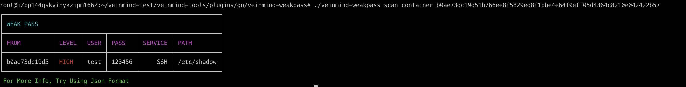
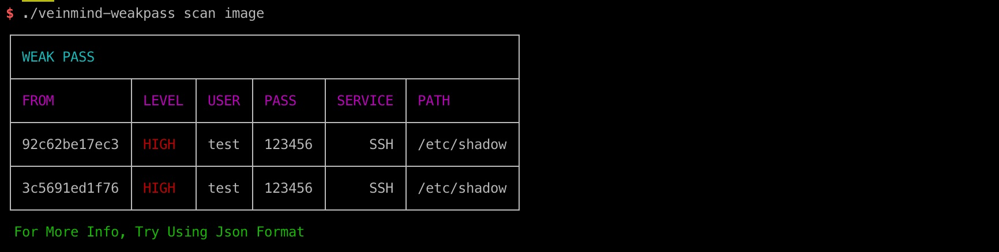
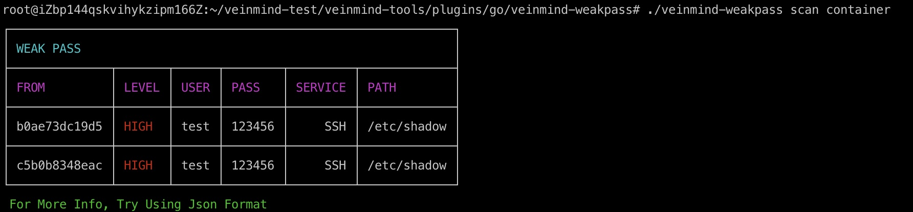
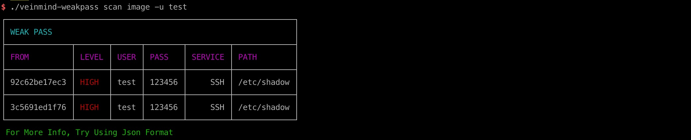
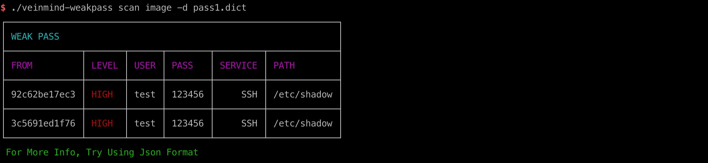
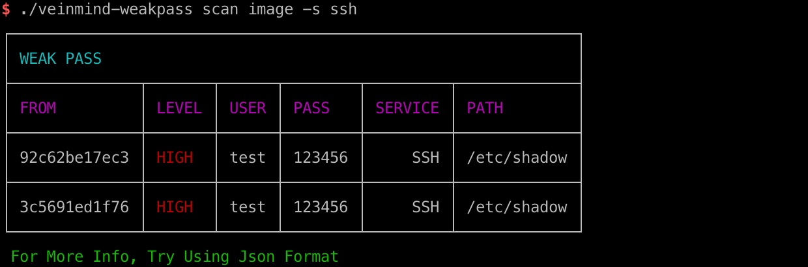
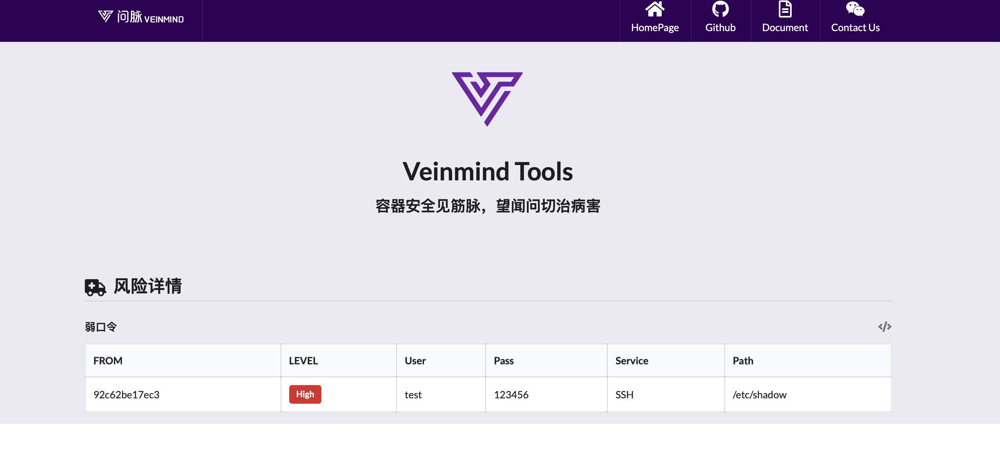

<h1 align="center"> veinmind-weakpass </h1>

<p align="center">
veinmind-weakpass is a container/image weak password scanning tool developed by Changting Technology
</p>

## Features

- Quickly scan images/containers for weak passwords
- Support for weak password macros
- Support concurrent scanning of weak passwords
- Support for custom usernames and dictionaries
- Support for the 'containerd'/' dockerd 'container runtime

## Compatibility

- linux/amd64
- linux/386
- linux/arm64
- linux/arm
## Usage

### Based on executable files

Please install ` libveinmind `, installation method can refer to [official documentation] (https://github.com/chaitin/libveinmind)
#### Makefile one-click command

```
make run ARG="scan xxx"
```
#### Compile your own executable file for scanning

Compile the executable
```
make build
```
Run the executable file for scanning
```
chmod +x veinmind-weakpass && ./veinmind-weakpass scan xxx
```
### Based on the parallel container pattern
Make sure you have 'docker' and 'docker-compose' installed on your machine
#### Makefile one-click command
```
make run.docker ARG="scan xxxx"
```
#### Build your own image for scanning
Build the 'veinmind-weakpass' image
```
make build.docker
```
Run the container to scan
```
docker run --rm -it --mount 'type=bind,source=/,target=/host,readonly,bind-propagation=rslave' veinmind-weakpass scan  xxx
```

## Use parameters
1. Specify the image name or image ID and scan (if the image exists locally)
```
./veinmind-weakpass scan image [imagename/imageid]
```

2. Specify the container name or ID and scan (if the corresponding container exists locally)
```
./veinmind-weakpass scan container [containername/containerid]
```


3. Scan all local images
```
./veinmind-weakpass scan container [containername/containerid]
```


4. Scan all local containers
```
./veinmind-weakpass scan container 
```


Specify the scan username type
```
./veinmind-weakpass scan image -u username
```


6. Specify a custom scan dictionary
```
./veinmind-weakpass scan image -d ./pass.dict
```


7. Specify the service for the custom scan
```
./veinmind-weakpass scan image -s ssh,mysql,redis
```
Currently supported services

| serverName | version |
        |:----------:|:-------:|
|     ssh    |   all   |
|    mysql   |   8.X   |
|    redis   |   all   |
|   tomcat   |   all   |
|     ftp    |   all   |


8. Unzip the default dictionary to local disk
```
./veinmind-weakpass extract
```
9. Specify the output format
Supported output formats:
- html
- json
- cli (default)
```
./veinmind-weakpass scan image [imageID/imageName] -f html
```
The resulting result.html looks like this:
