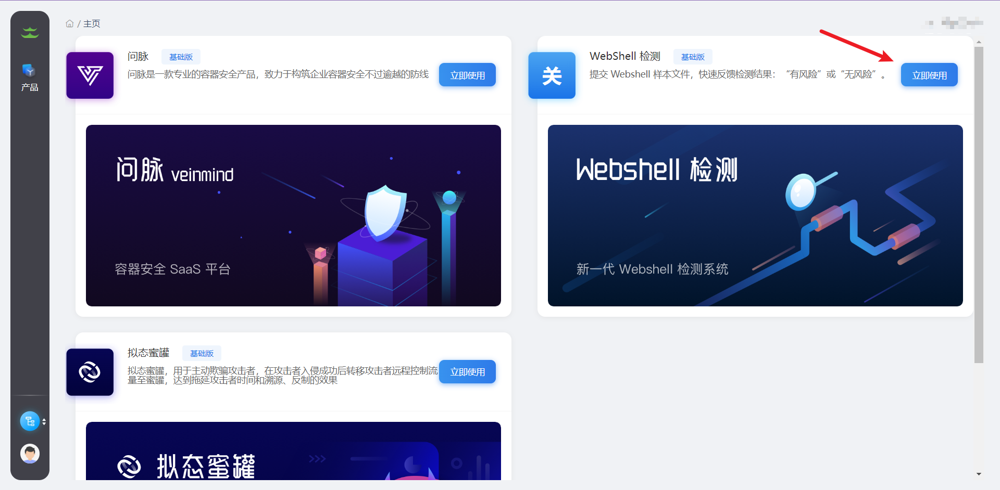
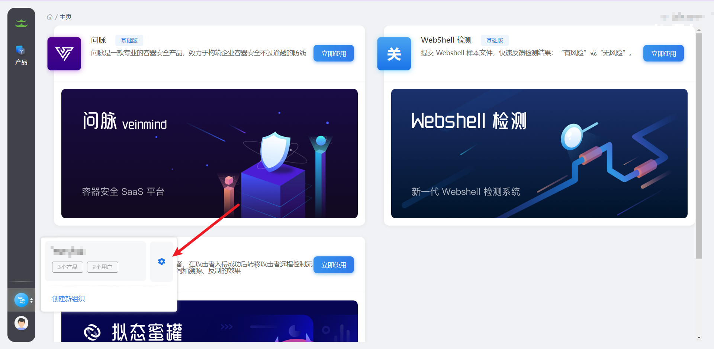
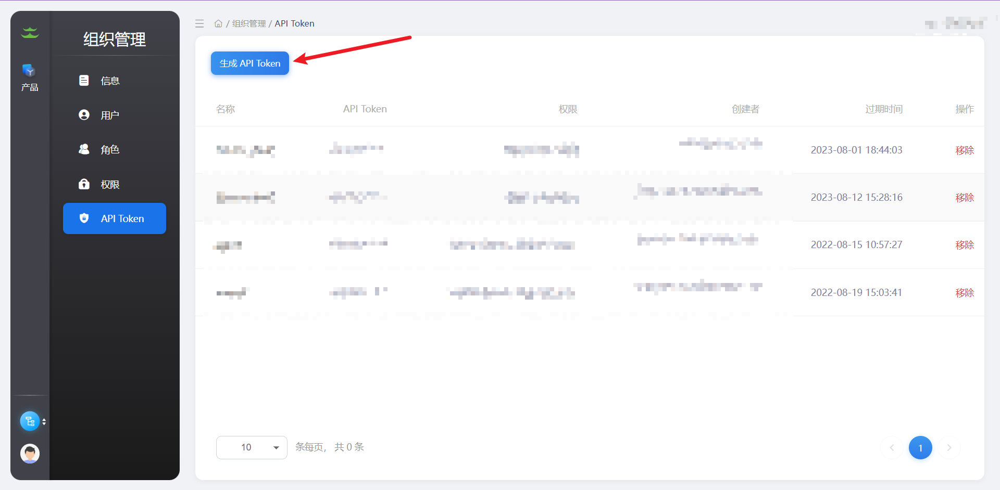
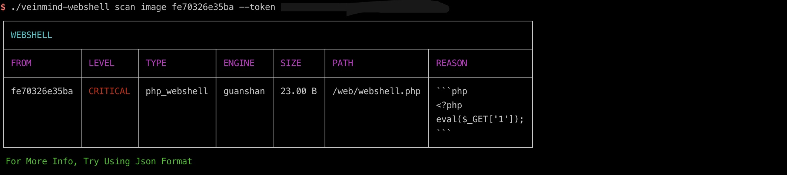
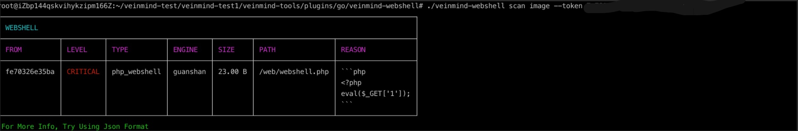
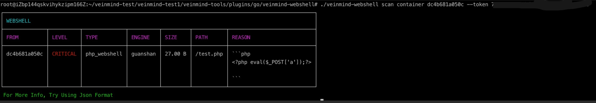
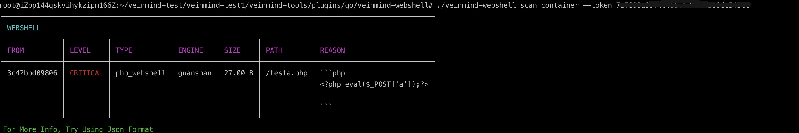
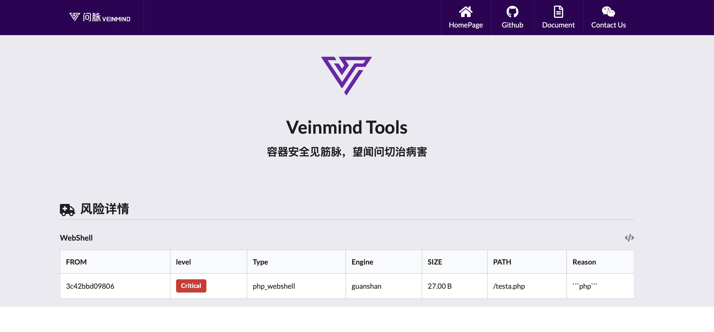

<h1 align="center"> veinmind-webshell </h1>

<p align="center">
veinmind-webshell is a Webshell scanning tool developed by Changting Technology
</p>

## Features

- Quickly scan Webshell in image/container
- Support for the 'containerd'/' dockerd 'container runtime

## Compatibility

- linux/amd64
- linux/386
- linux/arm64

## Usage

### Based on executable files

Please install ` libveinmind `, installation method can refer to [official documentation] (https://github.com/chaitin/libveinmind)
#### Makefile one-click command

```
make run ARG="scan xxx"
```
#### Compile your own executable file for scanning

Compile the executable
```
make build
```
Run the executable file for scanning
```
chmod +x veinmind-webshell && ./veinmind-webshell scan xxx
```
### Based on the parallel container pattern
Make sure you have 'docker' and 'docker-compose' installed on your machine
#### Makefile one-click command
```
make run.docker ARG="scan xxxx"
```
#### Build your own image for scanning
Build the 'veinmind-webshell' image
```
make build.docker
```
Run the container to scan
```
docker run --rm -it --mount 'type=bind,source=/,target=/host,readonly,bind-propagation=rslave' veinmind-webshell scan  xxx
```


## Usage

1. Login bacc the platform (https://rivers.chaitin.cn/), activate the guanshan Webshell detection products



2. Click on the bottom left corner to organize the configuration and create the API Token (the basic version is limited to 100 times per day, and the advanced version can be obtained by contacting the Wenmai assistant/Baichuan platform)





3. Scan the specified image with a token
```
./veinmind-webshell scan image [imageID/imageName] --token [Guan Shan token]
```

4. Scan all local images using token
```
./veinmind-webshell scan image --token [Guan Shan token]
```


5. Scan the specified container with a token
```
./veinmind - webshell scan the container containerID/containerName - token [guanshan token]
```


6.Scan all local containers using token
```
 ./veinmind-webshell scan container --token [token]
 ```


Specify the output format
Supported output formats:
- html
- json
- cli (default)
```
./veinmind-webshell scan container [containerID/containerName] --token [token] -f html
```
The resulting result.html looks like this:
