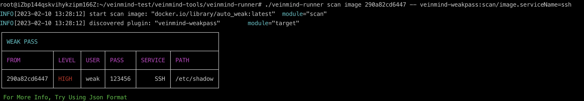

<h1 align="center"> veinmind-runner </h1>

<p align="center">
veinmind-runner 是由长亭科技自研的一款问脉容器安全工具平台
</p>

## 📸 基本介绍

长亭团队以丰富的研发经验为背景， 在 [veinmind-sdk]() 中设计了一套插件系统。 在该插件系统的支持下，只需要调用 [veinmind-sdk]() 所提供的API，即可自动化的生成符合标准规范的插件。(
具体代码示例可查看[example](./example))
`veinmind-runner`作为插件平台，会自动化的扫描符合规范的插件，并将需要扫描的镜像信息传递给对应的插件。


## 🔥 功能特性

<b>2023-3-24 - NEW</b>
- 🔥🔥🔥 支持接入`openai`对扫描出的安全事件进行人性化分析，让你您更加清晰地了解到本次扫描发现了哪些风险，并应该如何操作

> 注: 使用 openAI 时，请确保当前网络能够访问openAI
> 平行容器启动时，需要手动通过 docker run -e http_proxy=xxxx -e https_proxy=xxxx 设置代理（非全局代理的场景下）

<b>基本特性</b>
- 自动扫描并注册当前目录下(含子目录)的插件
- 统一运行基于不同语言实现的问脉插件
- 插件可以和`runner`进行通信，如上报事件进行告警等

## 💻 兼容性

- linux/amd64
- linux/386
- linux/arm64
- linux/arm

## 🕹️ 使用方式

### 基于可执行文件

请先安装`libveinmind`，安装方法可以参考[官方文档](https://github.com/chaitin/libveinmind)
#### Makefile 一键命令

```
make run ARG="scan xxx"
```
#### 自行编译可执行文件进行扫描

编译可执行文件
```
make build
```
运行可执行文件进行扫描
```
chmod +x veinmind-runner && ./veinmind-runner scan xxx 
```
### 基于平行容器模式
确保机器上安装了`docker`以及`docker-compose`
#### Makefile 一键命令
```
make run.docker ARG="scan xxxx"
```
#### 自行构建镜像进行扫描
构建`veinmind-runner`镜像
```
make build.docker
```
运行容器进行扫描
```
docker run --rm -it --mount 'type=bind,source=/,target=/host,readonly,bind-propagation=rslave' veinmind-runner scan xxx
```
### 基于kubernetes helm
基于`Kubernetes`环境，使用`Helm`安装`veinmind-runner`，定时执行扫描任务

请先安装`Helm`， 安装方法可以参考[官方文档](https://helm.sh/zh/docs/intro/install/)

安装`veinmind-runner`
之前，可配置执行参数，可参考[文档](https://github.com/chaitin/veinmind-tools/blob/master/veinmind-runner/script/helm_chart/README.md)

使用`Helm`安装 `veinmind-runner`

```
cd ./veinmind-runner/script/helm_chart/veinmind
helm install veinmind .
```
## ⚙️ ️使用参数
### 基本参数
参考 [veinmind-runner使用参数文档](docs/veinmind-runner.md)
### 高级参数
1.支持 使用openai 对结果进行智能分析
> 前置条件1：需要准备 openai_key， 具体申请方法请看: https://platform.openai.com/account/api-keys
> 前置条件2：扫描时的网络能够访问到openai

使用`--analyze`参数，将扫描加入openai结果分析:

`./veinmind-runner scan image --enable-analyze --openai-token <your_openai_key>`

如果觉得分析的结果不满意，可以自定义查询结果的语句，来调整openai对结果的分析：

`./veinmind-runner scan image --enable-analyze --openai-token <your_openai_key> -p "请对下面的安全事件进行剖析"`

或：
`./veinmind-runner scan image --enable-analyze --openai-token <your_openai_key> -p "解析下面的json发生了什么"`

也可以在扫描后对结果文件进行分析:

`./veinmind-runner analyze -r <path_to_result.json> --openai-token <your_openai_key>`

这种方式将对`result.json`进行解析， 同样支持`-p`参数自定义查询。

2.支持 docker 镜像阻断功能

```bash
# first
./veinmind-runner authz -c config.toml 
# second
dockerd --authorization-plugin=veinmind-broker
```

其中`config.toml`,包含如下字段

|  | **字段名**           | **字段属性** | **含义**  |
|----------|-------------------|----------|---------|
| policy   | action            | string   | 需要监控的行为 |
|          | enabled_plugins   | []string | 使用哪些插件  |
|          | plugin_params     | []string | 各个插件的参数 |
|          | risk_level_filter | []string | 风险等级    |
|          | block             | bool     | 是否阻断    |
|          | alert             | bool     | 是否报警    |
| log      | report_log_path   | string   | 插件扫描日志  |
|          | authz_log_path    | string   | 阻断服务日志  |

- action 原则上支持[DockerAPI](https://docs.docker.com/engine/api/v1.41/#operation/)所提供的操作接口
- 如下的配置表示：当 `创建容器`或`推送镜像` 时，使用 `veinmind-weakpass` 插件扫描`ssh`服务，如果发现有弱密码存在，并且风险等级为 `High`
  则阻止此操作，并发出警告。最终将扫描结果存放至`plugin.log`,将风险结果存放至`auth.log`。

``` toml
[log]
plugin_log_path = "plugin.log"
auth_log_path = "auth.log"
[listener]
listener_addr = "/run/docker/plugins/veinmind-broker.sock"
[[policies]]
action = "container_create"
enabled_plugins = ["veinmind-weakpass"]
plugin_paramas = ["veinmind-weakpass:scan.serviceName=ssh"]
risk_level_filter = ["High"]
block = true
alert = true
[[policies]]
action = "image_push"
enabled_plugins = ["veinmind-weakpass"]
plugin_params = ["veinmind-weakpass:scan.serviceName=ssh"]
risk_level_filter = ["High"]
block = true
alert = true
[[policies]]
action = "image_create"
enabled_plugins = ["veinmind-weakpass"]
plugin_params = ["veinmind-weakpass:scan.serviceName=ssh"]
risk_level_filter = ["High"]
block = true
alert = true
```
3.插件自定义参数
```
./veinmind-runner scan image -- [插件名称]:[运行插件函数cmd].[参数名称]=[自定义值]
```
示例：
```
./veinmind-runner scan image -- veinmind-weakpass:scan/image.serviceName=ssh
```
