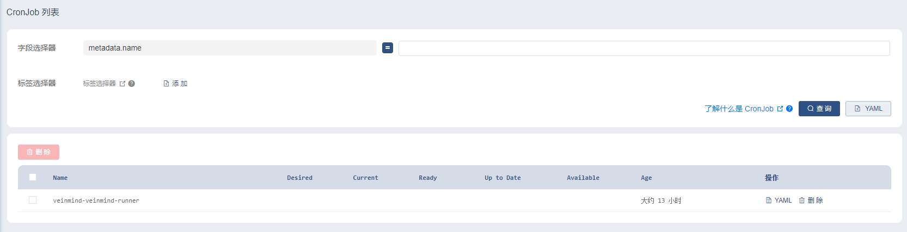
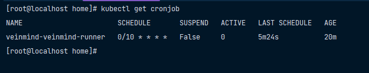
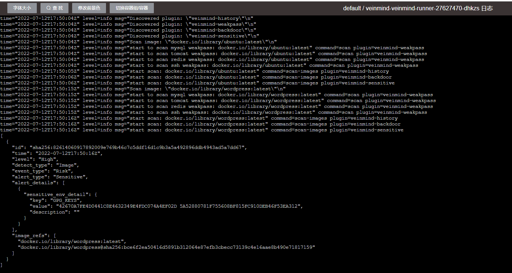

# Helm chart for Kubernetes

veinmind-runner镜像定时启动脚本，可使用crontab语法配置定时执行扫描镜像

## 安装
1. 确定本地运行Kubernetes服务
```bash
[root@localhost veinmind]# kubectl get pods -n kube-system
NAME                                       READY   STATUS    RESTARTS   AGE
calico-kube-controllers-6d75fbc96d-2d67s   1/1     Running   0          48m
calico-node-47fzd                          1/1     Running   0          48m
calico-typha-6576ff658-xsbbv               1/1     Running   0          48m
......
```
2. 安装helm
```
wget https://get.helm.sh/helm-v3.9.0-linux-amd64.tar.gz
tar -zxvf helm-v3.9.0-linux-amd64.tar.gz
mv linux-amd64/helm /usr/local/bin/helm
```

```bash
[root@localhost veinmind]# helm
The Kubernetes package manager

Common actions for Helm:

- helm search:    search for charts
- helm pull:      download a chart to your local directory to view
- helm install:   upload the chart to Kubernetes
- helm list:      list releases of charts
```

3. 进入`helm_chart\veinmind\`:
```bash
# 安装
[root@localhost veinmind]# helm install veinmind .
# 卸载
[root@localhost veinmind]# helm uninstall veinmind
```

## 配置解析
项目主要配置信息位于`values.yaml`:
```yaml
jobs:
  ### REQUIRED ###
  - name: veinmind-runner
    image:
      repository: registry.veinmind.tech/veinmind/veinmind-runner
      tag: latest
      imagePullPolicy: IfNotPresent
    schedule: "0 */8 * * *"   ### 扫描周期配置
    failedJobsHistoryLimit: 1
    successfulJobsHistoryLimit: 3
    concurrencyPolicy: Allow
    restartPolicy: OnFailure
  ### OPTIONAL ###
    command: ["/tool/entrypoint.sh"] ### 程序入口点
    args:
      - "scan image"     ### 运行参数
    nodeSelector:       ### 节点选择，可以依据标签将该任务推送到节点  类似的还有 nodeName,依据名称选择节点
      beta.kubernetes.io/arch: amd64
    resources:          ### 资源配置,1000m == 1 个 CPU 单元，相当于1 个物理 CPU 核，或1 个虚拟核
      limits:
        cpu: 1000m
        memory: 256Mi
      requests:
        cpu: 1000m
        memory: 256Mi
    volumes:
      - name: files-mount
        hostPath:
          path: /
      - name: sock-path
        hostPath:
          path: /var/run/docker.sock
    volumeMounts:
      - name: files-mount
        mountPath: /host
      - name: sock-path
        mountPath: /var/run/docker.sock
```
获取节点标签:
```bash
[root@localhost veinmind]# kubectl get nodes --show-labels 
NAME              STATUS   ROLES                              AGE   VERSION    LABELS
192.168.136.146   Ready    control-plane,etcd,master,worker   12h   v1.22.10   beta.kubernetes.io/arch=amd64,beta.kubernetes.io/os=linux,kubernetes.io/arch=amd64,kubernetes.io/hostname=192.168.136.146,kubernetes.io/os=linux,node-role.kubernetes.io/control-plane=,node-role.kubernetes.io/etcd=,node-role.kubernetes.io/master=,node-role.kubernetes.io/worker=,node.kubernetes.io/exclude-from-external-load-balancers=
```

## 运行截图




扫描结果请查询日志
