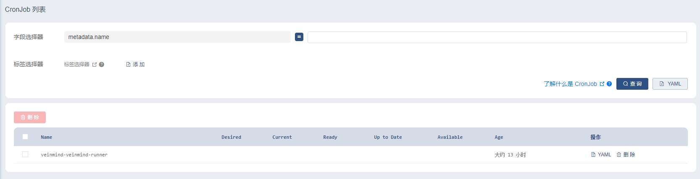
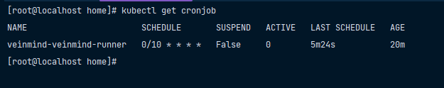
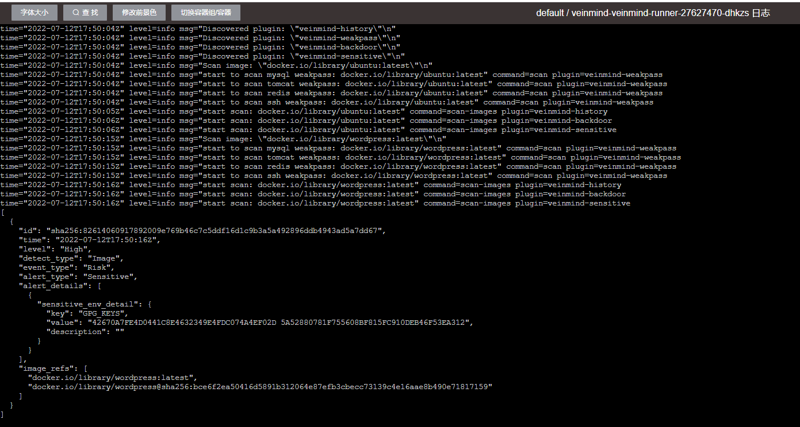

# Helm chart for Kubernetes

A timing startup script for veinmind-runner image, you can use crontab syntax to configure the regular execution scan target image
## Install 
1. Make sure to run the Kubernetes service locally
```bash
[root@localhost veinmind]# kubectl get pods -n kube-system
NAME                                       READY   STATUS    RESTARTS   AGE
calico-kube-controllers-6d75fbc96d-2d67s   1/1     Running   0          48m
calico-node-47fzd                          1/1     Running   0          48m
calico-typha-6576ff658-xsbbv               1/1     Running   0          48m
......
```
2. Install helm
```
wget https://get.helm.sh/helm-v3.9.0-linux-amd64.tar.gz
tar -zxvf helm-v3.9.0-linux-amd64.tar.gz
mv linux-amd64/helm /usr/local/bin/helm
```

```bash
[root@localhost veinmind]# helm
The Kubernetes package manager

Common actions for Helm:

- helm search:    search for charts
- helm pull:      download a chart to your local directory to view
- helm install:   upload the chart to Kubernetes
- helm list:      list releases of charts
```

3. Go to the `helm_chart\veinmind\` folder:
```bash
# 安装
[root@localhost veinmind]# helm install veinmind .
# 卸载
[root@localhost veinmind]# helm uninstall veinmind
```

## Configuration
```ymal
jobs:
  ### REQUIRED ###
  - name: veinmind-runner
    image:
      repository: veinmind/veinmind-runner
      tag: latest
      imagePullPolicy: IfNotPresent
    schedule: "0 */8 * * *"   ### Scan cycle
    failedJobsHistoryLimit: 1
    successfulJobsHistoryLimit: 3
    concurrencyPolicy: Allow
    restartPolicy: OnFailure
  ### OPTIONAL ###
    command: ["/tool/entrypoint.sh"] ### entry point
    args:
      - "scan-host"     ### parameters
    resources:          ### Resource configuration 1000m == 1 CPU,1 CPU unit is equivalent to 1 physical CPU core, or 1 virtual core
      limits:
        cpu: 1000m
        memory: 256Mi
      requests:
        cpu: 1000m
        memory: 256Mi
    volumes:
      - name: files-mount
        hostPath:
          path: /
      - name: sock-path
        hostPath:
          path: /var/run/docker.sock
    volumeMounts:
      - name: files-mount
        mountPath: /host
      - name: sock-path
        mountPath: /var/run/docker.sock
```

## Demo



Please check the log for scan results:
